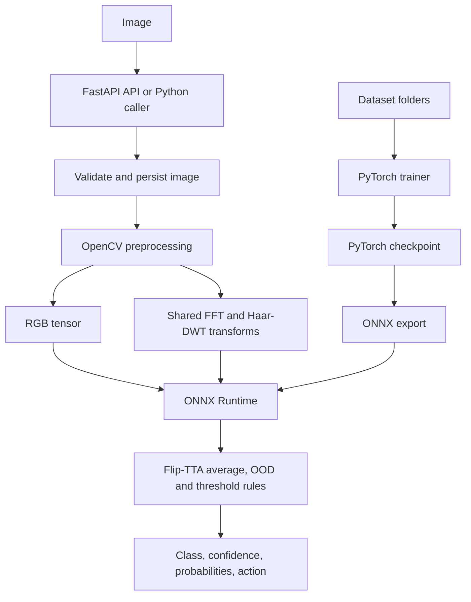
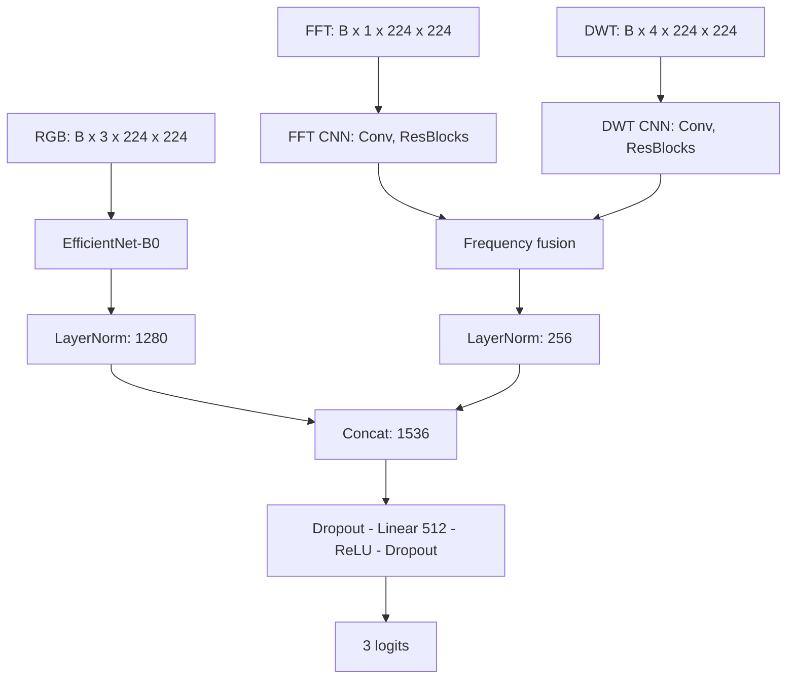
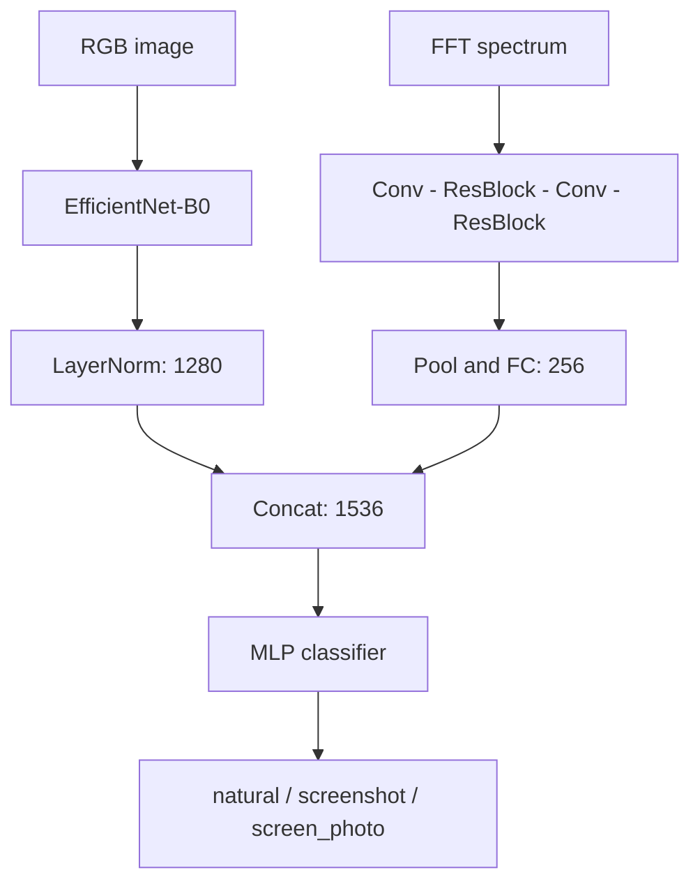
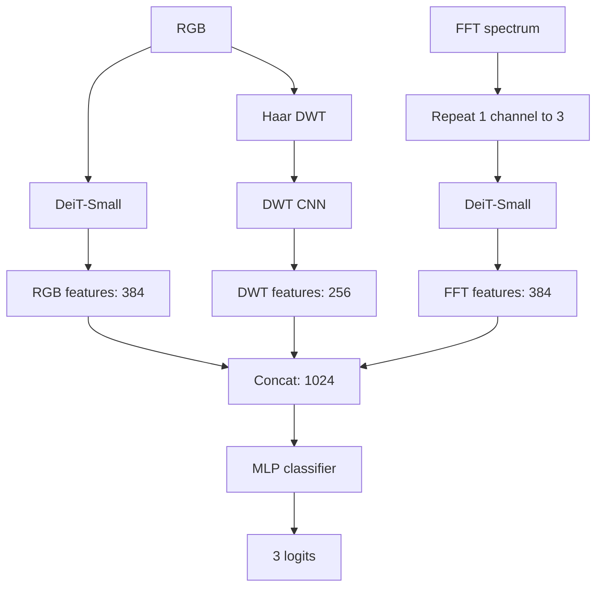
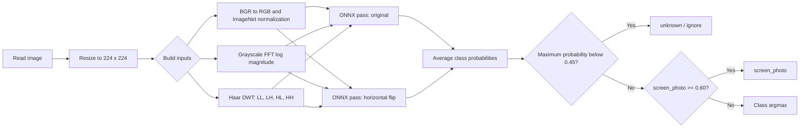
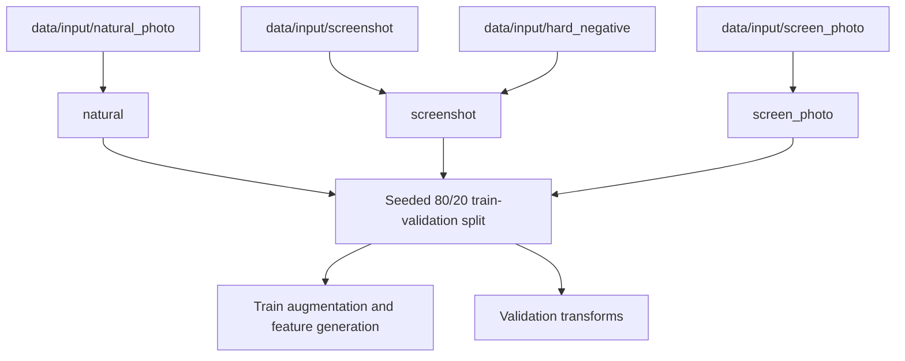
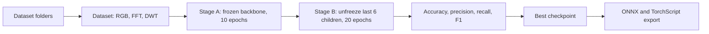
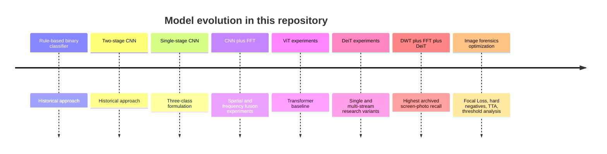

# OpenCV Screen Detector

[](pyproject.toml) [](https://pytorch.org/) [](https://fastapi.tiangolo.com/) [](https://onnxruntime.ai/)

**English** | [简体中文](README_CN.md)

## Project Introduction

OpenCV Screen Detector classifies an image source as **natural**, **screenshot**, or **screen photo** (a camera photograph of a display). It pairs spatial appearance with FFT and Haar-DWT frequency features, and ships a FastAPI service backed by ONNX Runtime.

The repository contains the deployable EfficientNet-B0 + FFT + DWT model, its PyTorch training pipeline, and reproducible CNN/DeiT research experiments. It is a classifier, not an object detector: it predicts one label for each input image.

## Project Highlights

- Three-source classification with an ONNX model that accepts RGB, FFT, and DWT inputs.
- Shared OpenCV preprocessing keeps FFT/DWT transforms consistent between training and serving.
- TTA, low-confidence/OOD handling, and screen-photo thresholding are built into inference.
- FastAPI supports upload and URL detection, classification updates, health checks, and ZIP export.
- Research harness compares CNN, FFT, DeiT, and DWT+FFT+DeiT variants.

## Table of Contents

<details>
<summary>Open the table of contents</summary>

- [Features](#features)
- [Project Architecture](#project-architecture)
- [Model Architecture](#model-architecture)
- [Image Classification Pipeline](#image-classification-pipeline)
- [Dataset](#dataset)
- [Installation](#installation)
- [Quick Start](#quick-start)
- [Training](#training)
- [Inference](#inference)
- [REST API](#rest-api)
- [Project Structure](#project-structure)
- [Experimental Results](#experimental-results)
- [Performance Comparison](#performance-comparison)
- [Model Evolution](#model-evolution)
- [Deployment](#deployment)
- [Configuration](#configuration)
- [Future Work](#future-work)
- [License](#license)
- [Acknowledgements](#acknowledgements)
</details>

## Features

| Area | Included capability |
| --- | --- |
| Classes | `natural`, `screenshot`, `screen_photo`; `unknown` for low-confidence inference |
| Training | Two-stage fine-tuning, AMP when CUDA is available, Focal Loss, weighted sampling, hard negatives |
| Features | ImageNet-normalized RGB, log-magnitude FFT, Haar DWT sub-bands |
| Inference | ONNX Runtime, horizontal-flip TTA, LRU feature cache, confidence tiers |
| Service | FastAPI, image upload/URL ingestion, SQLite image index, streaming ZIP packages |
| Research | CNN/FFT/DeiT ablations plus optional Center Loss, OHEM, ArcFace, attention, and threshold studies |

## Project Architecture



## Model Architecture

### Deployed CNN + FFT + DWT model

The default export is `ScreenDetectorModelWithDWT`. EfficientNet-B0 produces 1,280 spatial features. A two-stream frequency branch processes a one-channel FFT spectrum and four Haar-DWT sub-bands, then produces 256 features. Layer-normalized features are concatenated to 1,536 dimensions and classified into three logits.



### CNN + FFT research variant

This two-input variant remains available through `create_model(use_dwt=False)` and is used by the research code.



### DWT + FFT + DeiT research variant

The experimental triple-stream model uses RGB DeiT-Small features, a second DeiT-Small stream for a replicated three-channel FFT spectrum, and a DWT CNN. It is not the model loaded by the default API.



## Image Classification Pipeline



## Dataset

Place images under `data/input`. The dataset is local and is not distributed with this repository.



| Directory | Training label | Intended content |
| --- | --- | --- |
| `natural_photo/` | `natural` | Camera photos such as people, scenes, objects, and interiors |
| `screenshot/` | `screenshot` | Screenshots, UI, IDEs, slides, terminal windows, and chats |
| `hard_negative/` | `screenshot` | Difficult non-screen-photo boundary cases |
| `screen_photo/` | `screen_photo` | Camera photographs of displays |

The recorded deployable-model run used 2,937 images (2,349 train / 588 validation), including 58 hard negatives. Dataset composition changes over time; report the exact split with every new model.

## Installation

Requirements: Python `>=3.11,<3.13` and [uv](https://docs.astral.sh/uv/). Training is practical on a CUDA-capable GPU; serving can use ONNX Runtime on CPU.

```bash
# Run from this repository's root directory.
uv sync
```

The commands above work in PowerShell on Windows and in a POSIX shell on Linux/macOS. Install training dependencies only when needed:

```bash
uv sync --group train
```

## Quick Start

### Start the API

```bash
uv run python main.py
```

Open `http://127.0.0.1:8325/docs` for the generated OpenAPI interface.

### Run Python inference

```python
from pathlib import Path
from inference.predictor import ScreenDetectorPredictor

result = ScreenDetectorPredictor().predict(Path("path/to/image.jpg"))
print(result["class"], result["confidence"])
```

### Train and export ONNX

```bash
uv sync --group train
uv run python -m trainer train
uv run python -m trainer export
```

The exporter writes `inference/models/three_class.onnx`, which is the path used by the service.

## Training

The standard trainer initializes EfficientNet-B0 with pretrained weights, trains the head and frequency branch for 10 epochs, then unfreezes the last six backbone children for 20 fine-tuning epochs. It selects checkpoints with:

`0.5 * screen_photo_f1 + 0.3 * accuracy + 0.2 * macro_f1`



```bash
uv run python -m trainer train
uv run python -m trainer export
uv run python -m trainer ablation --modules baseline,arcface,attention --epochs-head 5 --epochs-finetune 10
```

Training outputs belong in `trainer/checkpoints/` and `trainer/logs/`. The optional PAH-ViT workflow is experimental:

```bash
uv run python -m trainer train_pahvit
uv run python -m trainer benchmark
uv run python -m trainer validate_pahvit
```

## Inference

The current ONNX graph has three named inputs: `rgb_input` (`B×3×224×224`), `fft_input` (`B×1×224×224`), and `dwt_input` (`B×4×224×224`). `ScreenDetectorPredictor` constructs all of them from a file path.

```bash
uv run python -m inference.batch_detect path/to/images inference/output/results.json
```

The predictor averages original and horizontally flipped predictions. It returns `unknown` when the maximum probability is below `0.45`; otherwise a `screen_photo` probability of at least `0.60` takes precedence, followed by argmax. Confidence actions are `accept` (≥0.92), `review` (≥0.75), and `ignore` (<0.75).

## REST API

| Endpoint | Purpose |
| --- | --- |
| `GET /api/health` | Service and model-load status |
| `POST /api/detect/upload` | Upload an image and return whether it is a screen photo |
| `POST /api/detect` | Download an image URL and classify it |
| `POST /api/classify` | Update a stored image classification |
| `POST /api/package` | Stream a ZIP of indexed images after a timestamp |

```bash
curl http://127.0.0.1:8325/api/health

curl -X POST http://127.0.0.1:8325/api/detect/upload \
  -F "file=@path/to/image.jpg"

curl -X POST http://127.0.0.1:8325/api/detect \
  -H "Content-Type: application/json" \
  -d '{"url":"https://example.com/image.jpg"}'
```

Example detection response:

```json
{"image_id":"<sha256>","is_screen":true}
```

`/api/package` accepts an ISO-8601 timestamp, for example `{"after_timestamp":"2026-07-01T00:00:00Z"}`. The stream is limited to 10,000 files and 20 GiB before compression.

## Project Structure

```text
opencv-screen-detector/
├── main.py                    # Uvicorn entry point
├── pyproject.toml             # Python dependencies and tool settings
├── Dockerfile.inference       # Inference image definition
├── shared/                    # Shared FFT/DWT transforms
├── inference/                 # ONNX Runtime predictor and FastAPI service
│   ├── api/                   # Application, routes, schemas, utilities
│   ├── models/                # three_class.onnx
│   ├── predictor.py           # TTA and post-processing
│   └── batch_detect.py        # Recursive batch inference
├── trainer/                   # CNN+FFT+DWT training and export
│   ├── model.py               # EfficientNet/frequency fusion models
│   ├── dataset.py             # RGB/FFT/DWT datasets
│   ├── train.py               # Two-stage trainer
│   └── ablation.py            # Optimization ablations
├── trainer_vit/               # ViT/DeiT experimental training code
├── experiment/                # Multi-model experiment runner
├── tests/                     # Unit and integration tests
└── data/                      # Local datasets and generated outputs (ignored)
```

## Experimental Results

### Deployed CNN + FFT + DWT run

The following is the recorded validation result dated 2026-07-05. It used the 2,937-image split described above and the standard 10+20 epoch training schedule. It is a single split, not a cross-validation estimate.

| Metric | Value |
| --- | ---: |
| Accuracy | 89.46% |
| Macro precision | 85.34% |
| Macro recall | 88.43% |
| Macro F1 | 86.68% |

| Class | Precision | Recall | F1 |
| --- | ---: | ---: | ---: |
| natural | 90.45% | 94.74% | 92.54% |
| screenshot | 94.59% | 88.05% | 91.21% |
| screen_photo | 70.97% | 82.50% | 76.30% |

### Research comparison

These five archived runs are single trials from the experiment harness; their 1500-image training set and validation split differ from the deployed run above. The table uses macro F1, and precision/recall/F1 in the final three columns refer specifically to `screen_photo`.

| Model | Accuracy | Macro F1 | SP precision | SP recall | SP F1 | Inference time | Model size |
| --- | ---: | ---: | ---: | ---: | ---: | --- | --- |
| EfficientNet-B0 (CNN) | 94.39% | 92.57% | 86.49% | 88.89% | 87.67% | Not recorded | Not recorded |
| CNN + FFT | 93.58% | 89.46% | 81.82% | 75.00% | 78.26% | Not recorded | Not recorded |
| DeiT-Small | 93.85% | 91.61% | 82.05% | 88.89% | 85.33% | Not recorded | Not recorded |
| FFT + DeiT | 93.32% | 91.71% | 88.57% | 86.11% | 87.32% | Not recorded | Not recorded |
| DWT + FFT + DeiT | 93.85% | 91.95% | 82.50% | 91.67% | 86.84% | Not recorded | Not recorded |

The repository does contain a 21.16 MiB `three_class.onnx` deployable artifact. It must not be compared directly with the research table because its training procedure and validation split differ.

### Ablation status

`trainer.ablation` defines baselines and individual toggles for Center Loss, OHEM, ArcFace, CBAM frequency attention, adaptive thresholding, and their combined configuration. No completed results file is committed for these toggles, so this README intentionally reports the available protocol rather than numerical claims.

## Performance Comparison

The research runs show a trade-off: the CNN baseline had the highest overall accuracy and screen-photo F1 (87.67%), while DWT+FFT+DeiT had the highest recorded screen-photo recall (91.67%). One trial per model and aggressive early stopping mean these observations are directional, not production benchmarks.

For a fair deployment comparison, benchmark exported models on the target hardware with the same warm-up, image set, batch size, and ONNX Runtime provider. Record p50/p95 latency, throughput, peak memory, artifact size, and class-wise metrics.

## Model Evolution



## Deployment

Run the API directly with `uv run python main.py`, or build the supplied container:

```bash
docker build -f Dockerfile.inference -t opencv-screen-detector:local .
docker run --rm -p 8325:8325 \
  -v "${PWD}/inference/models:/app/inference/models:ro" \
  -v "${PWD}/data:/app/data" \
  opencv-screen-detector:local
```

The Dockerfile copies code but not the ignored model artifact or data. Mount `inference/models/three_class.onnx` through the model directory as shown. The image exposes port 8325 and persists uploads/index data under `/app/data`.

## Configuration

Runtime settings are defined in `inference/config.py`; training defaults are in `trainer/config.py`.

| Setting | Default | Meaning |
| --- | ---: | --- |
| `image_size` | 224 | Spatial input width and height |
| `ood_threshold` | 0.45 | Maximum probability below this returns `unknown` |
| `confidence_high` | 0.92 | `accept` threshold |
| `confidence_medium` | 0.75 | `review` threshold |
| `BATCH_SIZE` | 16 | Standard training batch size |
| `EPOCHS_HEAD` / `EPOCHS_FINETUNE` | 10 / 20 | Two training stages |
| `FOCAL_LOSS_GAMMA` | 3.0 | Focal Loss focusing parameter |

Keep preprocessing, model inputs, and thresholds aligned when substituting a model. The current service expects the three-input ONNX graph described in [Inference](#inference).

## Future Work

- Run repeated seeds and cross-validation for the research models.
- Measure CPU/GPU latency, memory, and exported artifact sizes on target hardware.
- Grow and audit screen-photo boundary cases and document dataset provenance.
- Add calibration, threshold selection on a held-out set, and reproducible release artifacts.
- Add CI checks for training/export compatibility and API smoke tests.

## License

No license file is currently present in this repository. Until a license is added by the maintainers, reuse and redistribution rights are not granted by this documentation.

## Acknowledgements

Built with [PyTorch](https://pytorch.org/), [timm](https://github.com/huggingface/pytorch-image-models), [OpenCV](https://opencv.org/), [FastAPI](https://fastapi.tiangolo.com/), [ONNX Runtime](https://onnxruntime.ai/), and [uv](https://docs.astral.sh/uv/).
