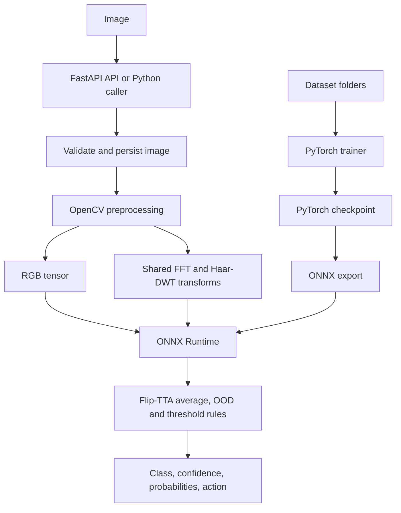
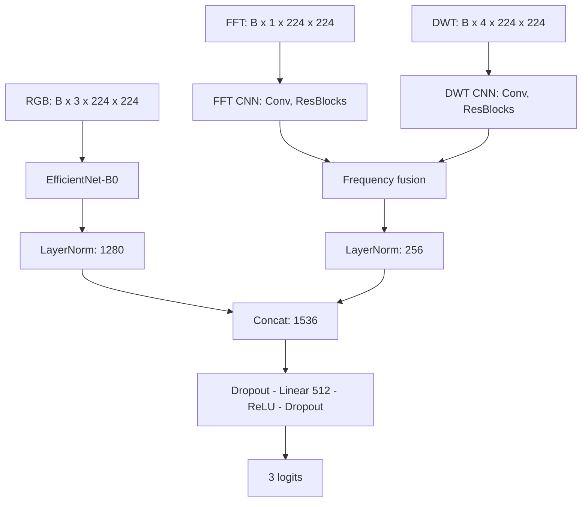
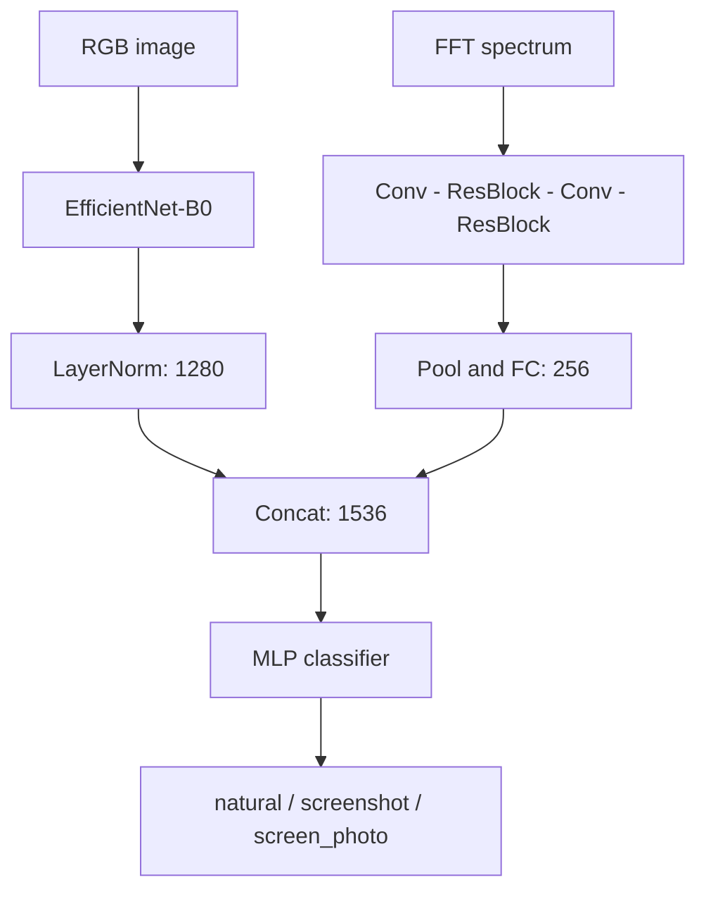
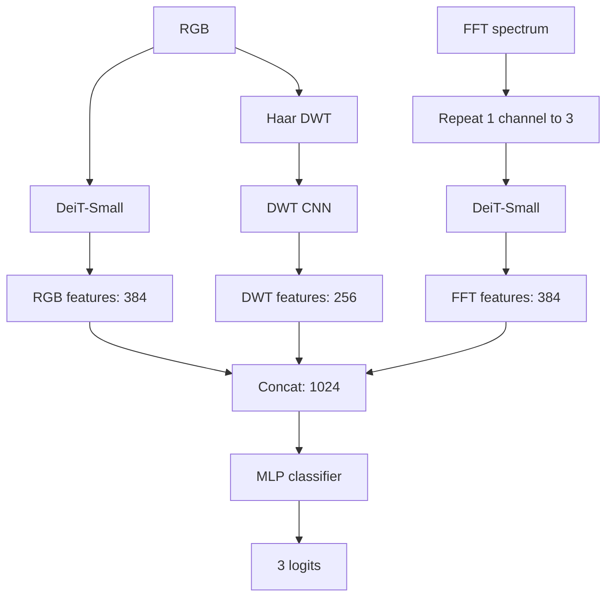
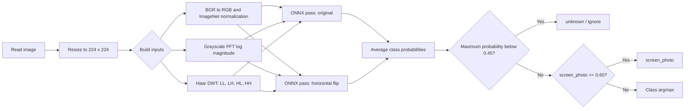
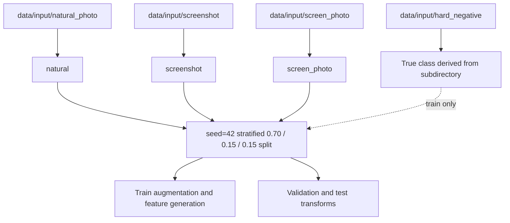
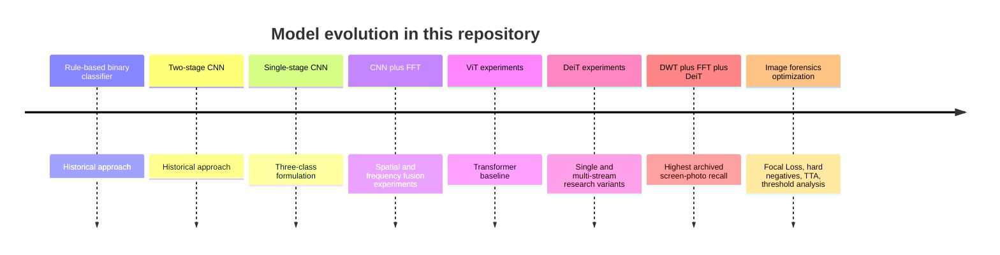

# OpenCV Screen Detector

[](pyproject.toml) [](https://pytorch.org/) [](https://fastapi.tiangolo.com/) [](https://onnxruntime.ai/)

**English** | [简体中文](README_CN.md)

## Project Introduction

OpenCV Screen Detector classifies an image source as **natural**, **screenshot**, or **screen photo** (a camera photograph of a display). It pairs spatial appearance with FFT and Haar-DWT frequency features, and ships a FastAPI service backed by ONNX Runtime.

The repository contains the deployable EfficientNet-B0 + FFT + DWT model, its PyTorch training pipeline, and reproducible CNN/DeiT research experiments. It is a classifier, not an object detector: it predicts one label for each input image.

## Project Highlights

- Three-source classification with an ONNX model that accepts RGB, FFT, and DWT inputs.
- Shared OpenCV preprocessing keeps FFT/DWT transforms consistent between training and serving.
- TTA, low-confidence/OOD handling, and screen-photo thresholding are built into inference.
- FastAPI supports upload and URL detection, classification updates, health checks, and ZIP export.
- Research harness compares CNN, FFT, DeiT, and DWT+FFT+DeiT variants.
- **`experiment/cnn_fft_dwt_ablation/` ablation harness**: 15+ configs train sequentially, results land in a leaderboard, ONNX export with PyTorch parity check, end-to-end deployment verification.

## Table of Contents

<details>
<summary>Open the table of contents</summary>

- [Features](#features)
- [Project Architecture](#project-architecture)
- [Model Architecture](#model-architecture)
- [Image Classification Pipeline](#image-classification-pipeline)
- [Dataset](#dataset)
- [Installation](#installation)
- [Quick Start](#quick-start)
- [Training](#training)
- [Inference](#inference)
- [REST API](#rest-api)
- [Project Structure](#project-structure)
- [Experimental Results](#experimental-results)
- [Performance Comparison](#performance-comparison)
- [Model Evolution](#model-evolution)
- [Deployment](#deployment)
- [Configuration](#configuration)
- [Future Work](#future-work)
- [License](#license)
- [Acknowledgements](#acknowledgements)
</details>

## Features

| Area | Included capability |
| --- | --- |
| Classes | `natural`, `screenshot`, `screen_photo`; `unknown` for low-confidence inference |
| Training | Two-stage fine-tuning, AMP when CUDA is available, Focal Loss (γ=2) + label smoothing, EMA (decay 0.999), weighted sampling, hard negatives |
| Features | ImageNet-normalized RGB, log-magnitude FFT, Haar DWT sub-bands |
| Inference | ONNX Runtime, horizontal-flip TTA, LRU feature cache, confidence tiers |
| Service | FastAPI, image upload/URL ingestion, SQLite image index, streaming ZIP packages |
| Research | `experiment/cnn_fft_dwt_ablation/` ablation harness (15-config matrix, automatic leaderboard); CNN/FFT/DeiT ablations |
| Deployment verification | `experiment/cnn_fft_dwt_ablation/deploy_eval.py` end-to-end ONNX benchmark script |

## Project Architecture



## Model Architecture

### Deployed CNN + FFT + DWT model

The default export is `ScreenDetectorModelWithDWT`. EfficientNet-B0 produces 1,280 spatial features. A two-stream frequency branch processes a one-channel FFT spectrum and four Haar-DWT sub-bands, then produces 256 features. Layer-normalized features are concatenated to 1,536 dimensions and classified into three logits.



### CNN + FFT research variant

This two-input variant remains available through `create_model(use_dwt=False)` and is used by the research code.



### DWT + FFT + DeiT research variant

The experimental triple-stream model uses RGB DeiT-Small features, a second DeiT-Small stream for a replicated three-channel FFT spectrum, and a DWT CNN. It is not the model loaded by the default API.



## Image Classification Pipeline



## Dataset

Place images under `data/input`. The dataset is local and is not distributed with this repository.



| Directory | Training label | Intended content |
| --- | --- | --- |
| `natural_photo/` | `natural` | Camera photos such as people, scenes, objects, and interiors |
| `screenshot/` | `screenshot` | Screenshots, UI, IDEs, slides, terminal windows, and chats |
| `hard_negative/` | Derived from subdirectory | Confirmed boundary cases keep their true class; train only, never in val/test |
| `screen_photo/` | `screen_photo` | Camera photographs of displays |

**Audited current data view** (updated 2026-09-06):

- Raw paths: **3,075**; unique SHA-256 content identities: **2,943**; byte-duplicate paths removed: **132**.
- The audit found 18 conflicting-label groups. All are resolved by 19 reviewed decisions in `trainer/content_label_overrides.json`; unresolved conflicts are rejected.
- Frozen split seed 42: **train 2,217 / val 361 / test 365**. Cross-role content overlap and hard-negative content in val/test are both zero.
- Current dataset fingerprint: `d8e5e2030fb4cb29e6404abfc75f64ef5ce1a70bea7b0502814ff7325f192704`.
- Evaluation fingerprint: `da74a983a7af3b5c1f73d1c80ccd5a7ed84a290e6f72dfb615a5eb6f73390eff` (unchanged).
- Any content identity represented under `hard_negative/` stays train-only, including its byte-identical copies elsewhere. New content is added to train without reshuffling frozen val/test identities.
- Five unique `screen_photo` images from `data/input/daily-package-2026-09-02.zip` … `2026-09-05.zip` were streamed into `data/input/screen_photo` with `uv run python -m trainer ingest`. Other zip folders, including `normal_photo`, were not written.

Run `uv run python -m trainer ingest` then `uv run python -m trainer audit` before training. The full machine-readable report is `trainer/data_audit.json`; the portable frozen manifest is `experiment/cnn_fft_dwt_ablation/split.json`. Exact SHA-256 overlap is currently zero, but group metadata is still 0/2,943 and a DCT-pHash scan found 19 cross-split candidate pairs in 17 clusters that require review. Therefore content/capture-group isolation is `NOT_READY`, not proven clean. The production model was trained on the 2026-08-07 snapshot (`972fc082…`, 2,183/361/365); the 34 newer unique contents are train-only and are not represented in the promoted weights.

Evaluation governance lives in `trainer/evaluation_sets/`: two known regressions are Canaries and may enter training; the independent Frozen challenge and true-OOD manifests are train/tuning-ineligible and currently `NOT_READY`; the Rolling error pool is an intake queue for reviewed future training rounds. The existing 365-image test remains a historical closed-set benchmark and is not the Frozen challenge or a true-OOD set.

Dataset composition changes over time; report the exact split with every new model.

## Installation

Requirements: Python `>=3.11,<3.13` and [uv](https://docs.astral.sh/uv/). Training is practical on a CUDA-capable GPU; serving can use ONNX Runtime on CPU.

```bash
# Run from this repository's root directory.
uv sync
```

The commands above work in PowerShell on Windows and in a POSIX shell on Linux/macOS. Install training dependencies only when needed:

```bash
uv sync --group train
```

## Quick Start

### Start the API

```bash
uv run python main.py
```

Open `http://127.0.0.1:8325/docs` for the generated OpenAPI interface.

### Run Python inference

```python
from pathlib import Path
from inference.predictor import ScreenDetectorPredictor

result = ScreenDetectorPredictor().predict(Path("path/to/image.jpg"))
print(result["class"], result["confidence"])
```

### Train and export ONNX

```bash
uv sync --group train
uv run python -m trainer ingest
uv run python -m trainer audit
uv run python -m trainer train --id <candidate-id>
uv run python experiment/cnn_fft_dwt_ablation/finalize_export.py experiment/cnn_fft_dwt_ablation/exp/<candidate-id>/best.pth experiment/cnn_fft_dwt_ablation/exp/<candidate-id>/candidate.onnx
uv run python experiment/cnn_fft_dwt_ablation/deploy_eval.py --model experiment/cnn_fft_dwt_ablation/exp/<candidate-id>/candidate.onnx --output experiment/cnn_fft_dwt_ablation/exp/<candidate-id>/deploy_eval.json
```

The exporter writes `inference/models/three_class.onnx`, which is the path used by the service.

## Training

### Two-stage training strategy

The release trainer initializes EfficientNet-B0 with pretrained weights, trains the head and frequency branch for 6 epochs, then unfreezes the last 3 MBConv stages for 12 fine-tuning epochs. Checkpoints are selected only by the held-out validation metric below. The selected checkpoint must then pass every entry in `trainer/evaluation_sets/canary.json`; Canary results block known regressions but are not promotion statistics.

`0.5 * screen_photo_f1 + 0.3 * accuracy + 0.2 * macro_f1`


```bash
# Audit content labels and materialize/verify the frozen evaluation manifest
uv run python -m trainer audit

# Reproducible candidate training (frozen split, deterministic seed, Canary gate).
# This does not overwrite the current production checkpoint.
uv run python -m trainer train --id <candidate-id>

# Historical trainer retained only for baseline reproduction
uv run python -m trainer train_legacy

uv run python -m trainer ablation --modules baseline,arcface,attention --epochs-head 5 --epochs-finetune 10
```

Training outputs belong in `trainer/checkpoints/` and `trainer/logs/`.

### Current release configuration

The 2026-08-07 release uses the same loss, EMA, backbone, augmentation, and FFT+DWT choices from the ablation sweep, with content-clean frozen data and deterministic seed-42 training:

| Setting | Value | Note |
| --- | --- | --- |
| Focal Loss γ | 2.0 | γ=3.0 costs ~3pp sp_f1 |
| Class α | [1.0, 1.0, 1.5] | α=2.0 slightly worse; α=2.5 collapses |
| Label smoothing | 0.05 | both 0 and 0.10 are worse |
| EMA | decay=0.999 | disabling costs 2.4pp sp_f1 |
| Unfrozen stages | 3 | current release candidate; earlier 15-config screen favored 1 stage |
| Canary sampler weight | 2.0 | the two known regressions may enter training; this is not generalization evidence |
| Epochs | 6 + 12 | selected checkpoint is finetune epoch 12 for training seed 42 |
| Backbone | efficientnet_b0 | B1 gives no measurable gain on a 6GB GPU |
| Augmentation | moderate | strong aug costs ~5pp acc |
| FFT + DWT | both enabled | removing DWT costs 5pp sp_f1 |

CUDA release training requires deterministic algorithms. The mathematically equivalent fixed/global mean pooling used for the 224×224 release input avoids CUDA's non-deterministic adaptive-pooling backward kernel; unsupported deterministic operations fail loudly.

### `experiment/cnn_fft_dwt_ablation/` ablation workflow

```bash
# 1) Launch the 15-config matrix (sequential, ~4h, writes to leaderboard.jsonl)
PYTHONUNBUFFERED=1 nohup uv run python -u experiment/cnn_fft_dwt_ablation/harness.py screen > experiment/cnn_fft_dwt_ablation/logs/screen.log 2>&1 &

# 2) Inspect archived leaderboard data (test metrics are reporting-only)
uv run python experiment/cnn_fft_dwt_ablation/show.py

# 3) Train controlled candidates with one frozen split and distinct training seeds.
# Keep all outputs as candidates; rank by validation only, then apply the Canary gate.
uv run python experiment/cnn_fft_dwt_ablation/run_candidate.py --validation-only --id clean_s42 --split-seed 42 --seed 42 --unfreeze 3 --canary-weight 2 --epochs-head 6 --epochs-finetune 12
uv run python experiment/cnn_fft_dwt_ablation/run_candidate.py --validation-only --id clean_s2024 --split-seed 42 --seed 2024 --unfreeze 3 --canary-weight 2 --epochs-head 6 --epochs-finetune 12
uv run python experiment/cnn_fft_dwt_ablation/run_candidate.py --validation-only --id clean_s7 --split-seed 42 --seed 7 --unfreeze 3 --canary-weight 2 --epochs-head 6 --epochs-finetune 12

# 4) Select by validation metric, require Canary pass, then open the legacy test once for that ID.
uv run python experiment/cnn_fft_dwt_ablation/run_candidate.py --evaluate-only --id clean_v4_s2024_final_20260730 --split-seed 42

# 5) Export ONNX and verify PyTorch <-> ONNX numerical parity
uv run python experiment/cnn_fft_dwt_ablation/finalize_export.py trainer/checkpoints/three_class_best.pth inference/models/three_class.onnx

# 6) End-to-end deployment verification on the frozen 365-image clean test set
uv run python experiment/cnn_fft_dwt_ablation/deploy_eval.py
```

Long deterministic runs can pause on an epoch boundary with `--max-total-epochs 12` and continue with the same ID plus `--resume`. The resume checkpoint atomically preserves the raw model, EMA, optimizer, scheduler, AMP scaler, sampler, augmentation, and Python/NumPy/Torch/CUDA RNG states. A 1+1 epoch resumed/control regression produced identical histories and model tensors.

`experiment/cnn_fft_dwt_ablation/` contains:
- `harness.py` — training loop, model, FFT/DWT cache, RAM preload, `ExpConfig` dataclass
- `run_candidate.py` — isolated candidate training with separate split/training seeds
- `finalist.py` — historical test-ranked finalist workflow; do not use for new model selection
- `finalize_export.py` — ONNX export with numerical parity check
- `deploy_eval.py` — end-to-end ONNX performance benchmark
- `show.py` — leaderboard viewer
- `leaderboard.jsonl` — all experimental records (JSONL append format)
- `REPORT.md` — full Chinese ablation report

`trainer/release_train.py` is the canonical wrapper around the current release configuration. It validates the dataset fingerprint, writes per-epoch history, backs up the previous checkpoint during training, and publishes `three_class_best.pth` only after a successful run. `trainer/train.py` remains available through `train_legacy` and does not define release defaults.

The optional PAH-ViT workflow is experimental:

```bash
uv run python -m trainer train_pahvit
uv run python -m trainer benchmark
uv run python -m trainer validate_pahvit
```

## Inference

The current ONNX graph has three named inputs: `rgb_input` (`B×3×224×224`), `fft_input` (`B×1×224×224`), and `dwt_input` (`B×4×224×224`). `ScreenDetectorPredictor` constructs all of them from a file path.

```bash
uv run python -m inference.batch_detect path/to/images inference/output/results.json
```

The predictor averages original and horizontally flipped predictions. It returns `unknown` when the maximum probability is below `0.45`; otherwise a `screen_photo` probability of at least `0.60` takes precedence, followed by argmax. Confidence actions are `accept` (≥0.92), `review` (≥0.75), and `ignore` (<0.75).

## REST API

| Endpoint | Purpose |
| --- | --- |
| `GET /api/health` | Service and model-load status |
| `POST /api/detect/upload` | Upload an image and return whether it is a screen photo |
| `POST /api/detect` | Download an image URL and classify it |
| `POST /api/classify` | Update a stored image classification |
| `POST /api/package` | Stream a ZIP of indexed images after a timestamp |

```bash
curl http://127.0.0.1:8325/api/health

curl -X POST http://127.0.0.1:8325/api/detect/upload \
  -F "file=@path/to/image.jpg"

curl -X POST http://127.0.0.1:8325/api/detect \
  -H "Content-Type: application/json" \
  -d '{"url":"https://example.com/image.jpg"}'
```

Example detection response:

```json
{"image_id":"<sha256>","is_screen":true}
```

`/api/package` accepts an ISO-8601 timestamp, for example `{"after_timestamp":"2026-07-01T00:00:00Z"}`. The stream is limited to 10,000 files and 20 GiB before compression. Both limits are validated before the streaming response starts, so an oversized request returns a normal JSON 413 response.

## Project Structure

```text
opencv-screen-detector/
├── main.py                    # Uvicorn entry point
├── pyproject.toml             # Python dependencies and tool settings
├── Dockerfile.inference       # Inference image definition
├── shared/                    # Shared FFT/DWT transforms
├── inference/                 # ONNX Runtime predictor and FastAPI service
│   ├── api/                   # Application, routes, schemas, utilities
│   ├── models/                # three_class.onnx
│   ├── predictor.py           # TTA and post-processing
│   └── batch_detect.py        # Recursive batch inference
├── trainer/                   # CNN+FFT+DWT training and export
│   ├── release_train.py       # Canonical release-training wrapper
│   ├── ingest_screen_photo.py # Stream only zip screen_photo members into data/input
│   ├── model.py               # EfficientNet/frequency fusion models
│   ├── evaluation_sets/       # Canary/challenge/rolling/OOD/group governance manifests
│   ├── hard_examples.txt      # Deprecated compatibility pointer to the Canary manifest
│   ├── dataset.py             # Legacy RGB/FFT/DWT datasets
│   ├── train.py               # Historical trainer (train_legacy)
│   └── ablation.py            # Optimization ablations
├── experiment/                # Multi-model experiment runner
│   └── cnn_fft_dwt_ablation/  # Ablation and release harness
│       ├── harness.py         # Training loop + ExpConfig + versioned cache
│       ├── finalist.py        # Historical multi-seed finalist training
│       ├── finalize_export.py # Historical ONNX parity helper
│       ├── deploy_eval.py     # Production ONNX end-to-end evaluation
│       ├── show.py            # Leaderboard viewer
│       ├── leaderboard.jsonl  # Experiment records
│       └── REPORT.md          # Full Chinese report
├── tests/                     # Unit and integration tests
└── data/                      # Local datasets and generated outputs (ignored)
```

## Experimental Results

> Status: `release_20260807_unf3_focus2_6x12` is the current production release. Its historical selection used the former 2/2 hard-example rule; those two images are now classified as Canaries. The 365-image test remains a legacy closed-set benchmark, while Frozen challenge and true-OOD promotion sets are `NOT_READY`.

### Current deployment (2026-08-07, `release_20260807_unf3_focus2_6x12`)

The seed-42 release run passed the 2/2 gate. The selected checkpoint is finetune epoch 12:

| Training seed | Validation accuracy | Validation screen_photo F1 | Validation Macro F1 | Validation metric | Gate |
| ---: | ---: | ---: | ---: | ---: | ---: |
| **42** | **0.9363** | **0.9550** | **0.9399** | **0.9463** | **2/2** |

The promoted checkpoint uses dataset fingerprint `972fc082…`. `three_class_best.pth` and `three_class_final.pth` have SHA-256 `cfd5c75c…`; the 22.18 MB LFS-tracked ONNX has SHA-256 `c53b00d5…` and passed PyTorch/ONNX numerical parity.

| Evaluation path | Accuracy | SP precision | SP recall | SP F1 | Macro F1 | Metric |
| --- | ---: | ---: | ---: | ---: | ---: | ---: |
| Validation winner (argmax) | 0.9363 | 0.9636 | 0.9464 | 0.9550 | 0.9399 | 0.9463 |
| Frozen test, PyTorch (argmax) | **0.9425** | **0.8966** | **0.9123** | **0.9043** | **0.9340** | **0.9217** |
| Production ONNX (TTA + OOD + threshold) | 0.9233 | 0.9123 | 0.9123 | 0.9123 | 0.9296 | 0.9190 |

The production row counts all 10 `unknown` results as errors, matching the API. Because every test item has a known class, these are known-class false rejections (10/365), not true-OOD detections. The test-only screen-photo threshold search (0.500) is diagnostic and is not reported as a release score because tuning on test would be optimistic.

**Confirmed screenshot regressions** (production ONNX with TTA):

| Image | Result | screenshot probability | screen_photo probability |
| --- | --- | ---: | ---: |
| `4a6e…ae8f9.png` | **`screenshot`** | 0.5818 | 0.2641 |
| `5cdc3…12a62.png` | **`screenshot`** | 0.5319 | 0.1690 |

**Production distribution**: 93 accept, 148 review, 114 low-confidence, and 10 known-class rejections; actions are 93 accept / 148 review / 124 ignore. The clean-test CPU TTA run measured mean 353.8 ms / p50 327.4 ms / p95 471.8 ms. Serial latency is environment-sensitive and was not used for candidate selection. The machine-readable result is `experiment/cnn_fft_dwt_ablation/deploy_eval_release_20260807.json`.

The frozen evaluation identity is unchanged from the 2026-08-04 release. On the same 365-image production path, this release improves accuracy by 2.74 percentage points, screen-photo F1 by 6.04 points, macro F1 by 2.96 points, and the release metric by 4.43 points.

### 2026-08-11 retraining gate (not deployed)

Two same-configuration candidates were trained on dataset fingerprint `b194d307…` with train/val/test = 2,212/361/365. The training gate uses EMA argmax on the two curated samples; the mandatory production gate additionally runs the exported ONNX through `ScreenDetectorPredictor`, including TTA and the 0.45 OOD threshold.

| Candidate | Selected epoch | Validation acc | SP F1 | Macro F1 | Metric | Training gate | Production gate | Frozen test |
| --- | ---: | ---: | ---: | ---: | ---: | ---: | ---: | --- |
| `release_20260811_unf3_focus2_6x12` (seed 42) | finetune-7 | 0.9086 | 0.8762 | 0.9012 | 0.8909 | 2/2 | **0/2** | evaluated once after selection |
| `release_20260811_s2024_unf3_focus2_6x12` (seed 2024) | finetune-11 | 0.9224 | 0.9000 | 0.9181 | 0.9104 | 2/2 | **1/2** | **sealed / not run** |

The seed-42 exported candidate passed ONNX parity, but its real production path returned both curated screenshots as `unknown`. On the frozen test it recorded accuracy 0.8849 / SP F1 0.8364 / macro F1 0.8964 / metric 0.8629 with 24 known-class false rejections. The seed-2024 export also passed parity, but one curated screenshot remained `unknown`; its test set was therefore not opened. Neither candidate replaced production. Machine-readable seed-42 evidence is `experiment/cnn_fft_dwt_ablation/deploy_eval_rejected_release_20260811_seed42.json`.

### 2026-09-06 candidate (not deployed)

Five new unique `screen_photo` files were added as train-only (fingerprint `d8e5e203…`, train/val/test = 2,217/361/365). A from-scratch Remix Mixup run (`candidate_20260906_remix_sp5`) selected finetune-12, scored PyTorch test metric **0.9111**, and failed Canary **0/2**.

The selected candidate is `candidate_20260906_lwf_sp5`: warm-start from the production checkpoint, skip Stage A, 8-epoch Stage B at `lr=3e-4`, LwF distillation (`α=1.0`, `T=2`), and 8× sampler weight on the five new files. Selected epoch is finetune-2. Production `three_class.onnx` (`c53b00d5…`) was not overwritten.

| Path | Accuracy | SP precision | SP recall | SP F1 | Macro F1 | Metric | Canary |
| --- | ---: | ---: | ---: | ---: | ---: | ---: | ---: |
| Validation winner (argmax) | 0.9446 | 0.9815 | 0.9464 | 0.9636 | 0.9486 | **0.9549** | **2/2** |
| Frozen test, PyTorch (argmax) | 0.9479 | 0.8833 | 0.9298 | 0.9060 | 0.9389 | **0.9252** | — |
| Candidate ONNX (TTA + OOD + threshold) | 0.9288 | 0.9138 | 0.9298 | 0.9217 | 0.9369 | **0.9269** | **2/2** |

The Predictor row counts 11 `unknown` results as errors (7 natural / 1 screenshot / 3 screen_photo). Both Canary screenshots remain `screenshot` (0.5700 / 0.2686 and 0.5205 / 0.1795). CPU TTA latency was mean 170.0 ms / p50 159.5 ms / p95 224.4 ms. Machine-readable result: `experiment/cnn_fft_dwt_ablation/deploy_eval_candidate_20260906_lwf_sp5.json`.

| Compared with production 2026-08-07 | PyTorch test metric | Predictor metric | Canary |
| --- | ---: | ---: | ---: |
| Production `release_20260807_unf3_focus2_6x12` | 0.9217 | 0.9190 | 2/2 |
| Candidate `candidate_20260906_lwf_sp5` | **0.9252** | **0.9269** | **2/2** |

Recipe:

```bash
uv run python -m trainer ingest
uv run python -m trainer audit
uv run python -m trainer train --id candidate_20260906_lwf_sp5 \
  --init-checkpoint trainer/checkpoints/three_class_best.pth \
  --epochs-head 0 --epochs-finetune 8 --lr 3e-4 --remix-alpha 0 \
  --boost-weight 8 --distill-alpha 1.0 --distill-temperature 2.0 \
  --boost-path data/input/screen_photo/<new-sha>.jpg
```

### Historical deployment context

The previous production artifacts were measured on a different 368-image list and are retained only as historical context:

| Historical production ONNX | Accuracy | screen_photo F1 | Macro F1 | Metric | Required screenshot gate |
| --- | ---: | ---: | ---: | ---: | ---: |
| Previous production (`4b419976…`) | 0.9402 | 0.8870 | 0.9376 | 0.9131 | 0/2 |
| Previous README release (`cbba84bd…`) | 0.9158 | 0.8598 | 0.9145 | 0.8875 | 2/2 |
| 2026-07-22 release (`96aedc9f…`) | 0.9158 | 0.9043 | 0.9262 | 0.9121 | 2/2 |

The historical values are not controlled comparisons with the current clean release because the split, training provenance, and hard-negative handling differ.

### Archived pre-clean 3-seed finalist training

| Seed | test_acc | test_sp_f1 | test_macro_f1 | metric |
| --- | ---: | ---: | ---: | ---: |
| 42 | 0.9322 | 0.8548 | 0.9174 | 0.8952 |
| 2024 | 0.9133 | 0.8276 | 0.8963 | 0.8670 |
| 7 | 0.9079 | 0.7788 | 0.8817 | 0.8381 |
| **AVG** | **0.9178** | **0.8204** | **0.8985** | **0.8668** |

These archived runs used the earlier 369-image split and lacked the current content audit and release protocol.

### Ablation matrix (15 configs, screening stage H=6+F=12)

Full records live in `experiment/cnn_fft_dwt_ablation/leaderboard.jsonl`. Summary sorted by test_metric:

| Rank | id | test_acc | test_spF1 | macro_F1 | metric | Change vs. baseline |
| ---: | --- | ---: | ---: | ---: | ---: | --- |
| 🥇 | **a_unf1** | **0.9431** | 0.8943 | **0.9342** | **0.9169** | unfreeze=1 (winner) |
| 🥈 | a_unf3 | 0.9295 | **0.9000** | 0.9239 | 0.9136 | unfreeze=3 |
| 🥉 | a_b1 | 0.9295 | 0.8926 | 0.9219 | 0.9095 | B1 backbone + unfreeze=1 |
| 4 | ref | 0.9322 | 0.8814 | 0.9227 | 0.9049 | clean default (unfreeze=2) |
| 5 | a_alpha20 | 0.9295 | 0.8780 | 0.9201 | 0.9019 | α=2.0 |
| 6 | a_noema | 0.9187 | 0.8571 | 0.9070 | 0.8856 | no EMA |
| 7 | a_gamma3 | 0.9214 | 0.8522 | 0.9079 | 0.8841 | γ=3.0 |
| 8 | a_ls0 | 0.9295 | 0.8448 | 0.9128 | 0.8838 | no label smoothing |
| 9 | a_ls10 | 0.9214 | 0.8308 | 0.9050 | 0.8728 | label smoothing=0.10 |
| 10 | a_fftonly | 0.9187 | 0.8308 | 0.9024 | 0.8715 | no DWT |
| 11 | old_focal | 0.9051 | 0.8293 | 0.8906 | 0.8643 | old strategy (γ3, heavy aug, all-unfreeze, no EMA) |
| 12 | a_cb99 | 0.9133 | 0.8214 | 0.8945 | 0.8636 | class-balanced sampling β=0.99 |
| 13 | a_heavyaug | 0.8943 | 0.8254 | 0.8810 | 0.8572 | strong augmentation |
| 14 | a_attn | 0.9106 | 0.7767 | 0.8827 | 0.8381 | +CBAM |
| 15 | a_alpha25 | 0.8943 | 0.7521 | 0.8664 | 0.8176 | α=2.5 |

**Key ablation findings**:
- ✅ **Wins**: Focal (γ=2) + LS=0.05, EMA, unfreeze 1 stage, B0 + FFT + DWT, moderate augmentation
- ❌ **Hurts**: CBAM attention (sp_f1 −10pp), class-balanced sampling, strong augmentation (−5pp), γ=3, α=2.5 (−13pp), full unfreeze
- 🏆 **Old vs new strategy**: old (γ3 + heavy + all-unfreeze + no-EMA) → new (γ2 + LS + EMA + unf1) gains **+5.2pp sp_f1**

### Research comparison

These five archived runs are single trials from the experiment harness; their 1500-image training set and validation split differ from the deployed run above. The table uses macro F1, and precision/recall/F1 in the final three columns refer specifically to `screen_photo`.

| Model | Accuracy | Macro F1 | SP precision | SP recall | SP F1 | Inference time | Model size |
| --- | ---: | ---: | ---: | ---: | ---: | --- | --- |
| EfficientNet-B0 (CNN) | 94.39% | 92.57% | 86.49% | 88.89% | 87.67% | Not recorded | Not recorded |
| CNN + FFT | 93.58% | 89.46% | 81.82% | 75.00% | 78.26% | Not recorded | Not recorded |
| DeiT-Small | 93.85% | 91.61% | 82.05% | 88.89% | 85.33% | Not recorded | Not recorded |
| FFT + DeiT | 93.32% | 91.71% | 88.57% | 86.11% | 87.32% | Not recorded | Not recorded |
| DWT + FFT + DeiT | 93.85% | 91.95% | 82.50% | 91.67% | 86.84% | Not recorded | Not recorded |

The repository does contain a 22.2 MB `three_class.onnx` deployable artifact. It must not be compared directly with the research table because its training procedure and validation split differ.

## Performance Comparison

The current production release's one-time PyTorch test result is **acc 0.9425 / sp_f1 0.9043 / macro_f1 0.9340 / metric 0.9217**. The real production ONNX path, which adds TTA, low-confidence rejection, and screen-photo thresholding, records **acc 0.9233 / sp_f1 0.9123 / macro_f1 0.9296 / metric 0.9190**; the 2/2 Canary passed, which is regression evidence only.

The 2026-09-06 candidate `candidate_20260906_lwf_sp5` is **not promoted**. On the same frozen 365-image test it records PyTorch **acc 0.9479 / sp_f1 0.9060 / macro_f1 0.9389 / metric 0.9252** and Predictor **acc 0.9288 / sp_f1 0.9217 / macro_f1 0.9369 / metric 0.9269**, with Canary 2/2.

The 2026-07-22 PyTorch argmax result (0.9429 / 0.9076 / 0.9361 / 0.9239) is numerically close, but it was measured on a different split. The small deltas are not evidence that one model generalizes better; the clean release is preferred because its data identities, labels, frozen evaluation split, candidate selection, and one-time test opening are auditable.

For research models, the CNN baseline had the highest overall accuracy and screen-photo F1 (87.67%), while DWT+FFT+DeiT had the highest recorded screen-photo recall (91.67%). One trial per model and aggressive early stopping mean those observations are directional, not production benchmarks.

For a deployment comparison, benchmark exported models on the target hardware with the same warm-up, image set, batch size, and ONNX Runtime provider. Record p50/p95 latency, throughput, peak memory, artifact size, class-wise metrics, and mandatory regression gates. `experiment/cnn_fft_dwt_ablation/deploy_eval.py` accepts `--model`, `--output`, and `--label`; the current release result is stored in `deploy_eval_release_20260807.json` and measured mean 353.8 ms / p50 327.4 ms / p95 471.8 ms on the recorded CPU run.

## Model Evolution



## Deployment

Run the API directly with `uv run python main.py`, or build the supplied container:

```bash
docker build -f Dockerfile.inference -t opencv-screen-detector:local .
docker run --rm -p 8325:8325 \
  -v "${PWD}/inference/models:/app/inference/models:ro" \
  -v "${PWD}/data:/app/data" \
  opencv-screen-detector:local
```

The Dockerfile copies the tracked LFS model under `inference/models/`, but not the ignored training data. The image exposes port 8325 and persists uploads/index data under `/app/data`; ensure Git LFS materializes the ONNX object before building locally.

## Configuration

Runtime settings are defined in `inference/config.py`; release-training defaults are in `trainer/release_train.py` and `experiment/cnn_fft_dwt_ablation/harness.py`. `trainer/config.py` serves legacy and PAH-ViT research paths.

| Setting | Default | Meaning |
| --- | ---: | --- |
| `image_size` | 224 | Spatial input width and height |
| `ood_threshold` | 0.45 | Maximum probability below this returns `unknown` |
| `confidence_high` | 0.92 | `accept` threshold |
| `confidence_medium` | 0.75 | `review` threshold |
| `screen_photo_threshold` | 0.60 | screen_photo probability at or above this forces that class |
| `BATCH_SIZE` | 16 | Standard training batch size |
| `EPOCHS_HEAD` / `EPOCHS_FINETUNE` | 6 / 12 | Release-training stages |
| `FOCAL_LOSS_GAMMA` | 2.0 | Focal Loss focusing parameter (adjusted from 3.0 after ablation) |
| `LABEL_SMOOTHING` | 0.05 | Label smoothing (ablation showed 0.05 > 0 / 0.10) |
| `EMA_DECAY` | 0.999 | Weight EMA decay |
| `UNFREEZE_STAGES` | 3 | Number of MBConv stages unfrozen in release stage B |
| Canary weight (`focus_weight` legacy field) | 2.0 | Sampler multiplier for `trainer/evaluation_sets/canary.json`; the old name remains for checkpoint compatibility |

Keep preprocessing, model inputs, and thresholds aligned when substituting a model. The current service expects the three-input ONNX graph described in [Inference](#inference).

## Future Work

- ~~Run repeated seeds and cross-validation for the research models.~~ (Done in `experiment/cnn_fft_dwt_ablation/finalist.py` with 3 seeds.)
- Populate and freeze 100-300 independent challenge samples; the manifest and gate exist but are currently `NOT_READY`.
- Populate a labeled true-OOD set and review the 19 pHash cross-split candidate pairs plus capture-group metadata.
- Calibrate decision thresholds on a dedicated validation/calibration set; keep the test-set threshold scan diagnostic-only.
- Further grow and audit screen-photo boundary cases, document dataset provenance.
- Add CI checks for training/export compatibility and API smoke tests.
- Explore finer-grained FFT recalibration (per-bin mean/std), Mixup/CutMix, and multi-task joint training.

## License

This project is licensed under the [MIT License](LICENSE).

## Acknowledgements

Built with [PyTorch](https://pytorch.org/), [timm](https://github.com/huggingface/pytorch-image-models), [OpenCV](https://opencv.org/), [FastAPI](https://fastapi.tiangolo.com/), [ONNX Runtime](https://onnxruntime.ai/), and [uv](https://docs.astral.sh/uv/).
