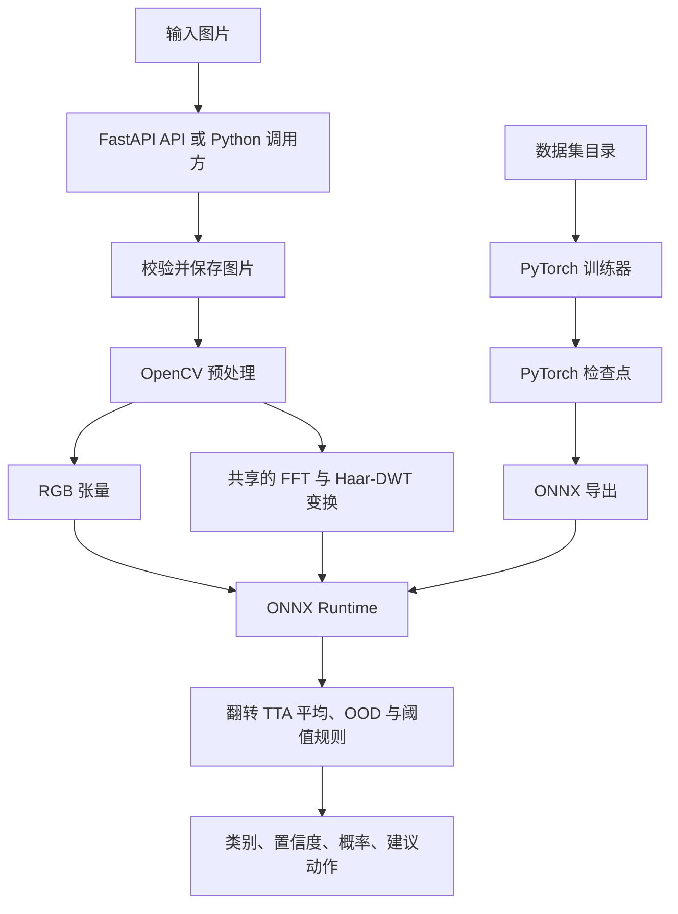
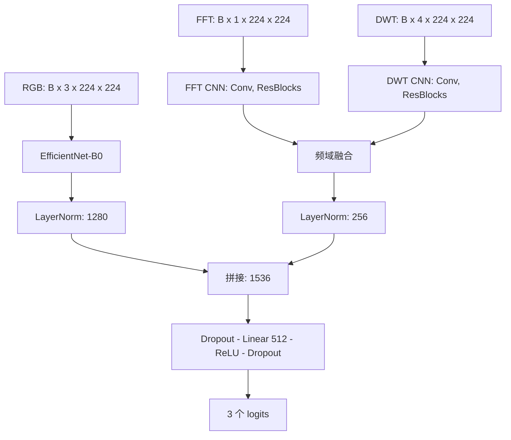
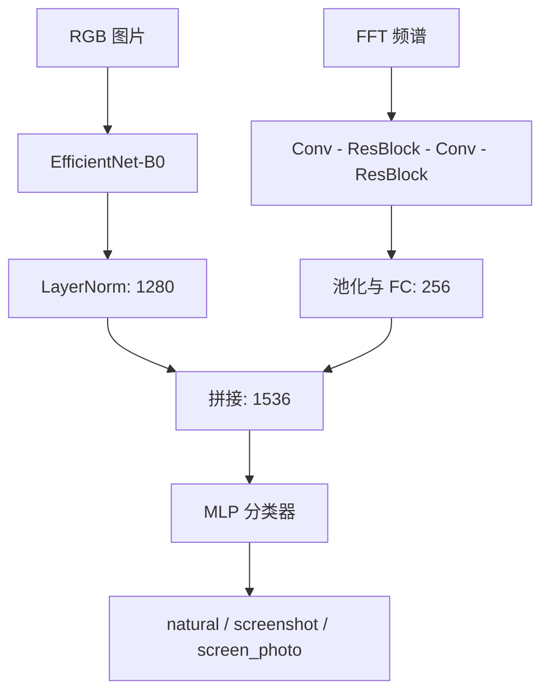
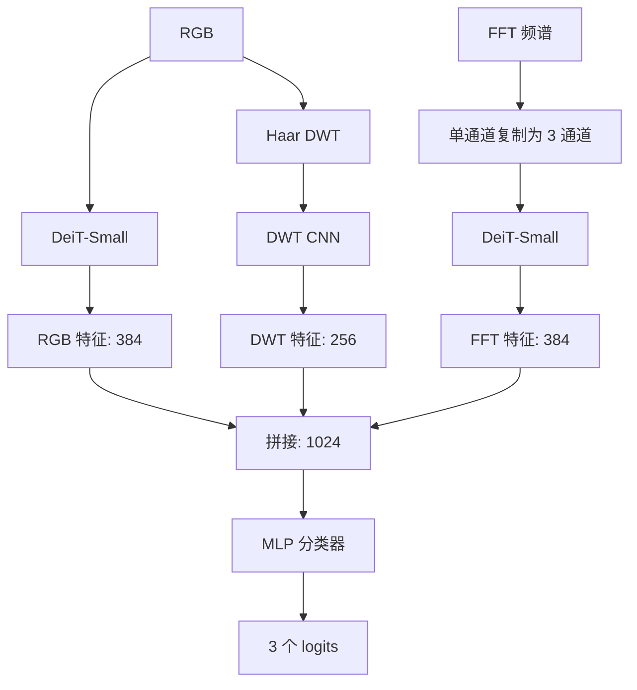
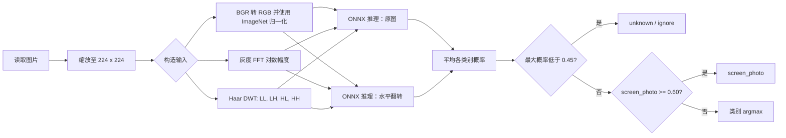
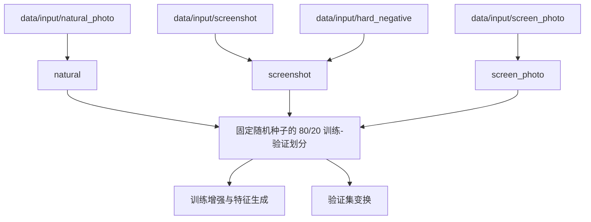
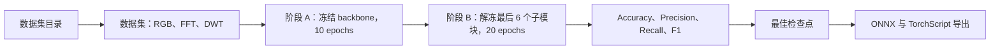
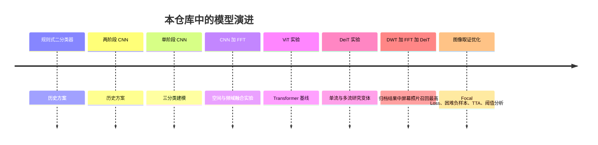

# OpenCV Screen Detector

[](pyproject.toml) [](https://pytorch.org/) [](https://fastapi.tiangolo.com/) [](https://onnxruntime.ai/)

[English](README.md) | **简体中文**

## 项目介绍

OpenCV Screen Detector 用于识别图像来源，将每张图片分类为 **natural**（自然照片）、**screenshot**（截图）或 **screen_photo**（相机拍摄的屏幕）。项目结合空间外观、FFT 与 Haar-DWT 频域特征，并提供基于 ONNX Runtime 的 FastAPI 服务。

仓库包含可部署的 EfficientNet-B0 + FFT + DWT 模型、对应的 PyTorch 训练流程，以及可复现实验用的 CNN/DeiT 研究代码。这是图像分类器而非目标检测器：每张输入图片只输出一个类别。

## 项目亮点

- 三来源分类；ONNX 模型同时接收 RGB、FFT 与 DWT 输入。
- 训练和服务端共用 OpenCV 预处理，保证 FFT/DWT 变换一致。
- 推理内置 TTA、低置信度/OOD 处理及屏幕照片阈值规则。
- FastAPI 支持文件上传、URL 检测、分类更新、健康检查与 ZIP 导出。
- 研究流程可对比 CNN、FFT、DeiT 与 DWT+FFT+DeiT 模型。

## 目录

<details>
<summary>展开目录</summary>

- [功能特性](#功能特性)
- [项目架构](#项目架构)
- [模型架构](#模型架构)
- [图像分类流程](#图像分类流程)
- [数据集](#数据集)
- [安装](#安装)
- [快速开始](#快速开始)
- [训练](#训练)
- [推理](#推理)
- [REST API](#rest-api)
- [项目结构](#项目结构)
- [实验结果](#实验结果)
- [性能对比](#性能对比)
- [模型演进](#模型演进)
- [部署](#部署)
- [配置](#配置)
- [未来工作](#未来工作)
- [许可证](#许可证)
- [致谢](#致谢)
</details>

## 功能特性

| 范畴 | 已实现能力 |
| --- | --- |
| 类别 | `natural`、`screenshot`、`screen_photo`；低置信度时输出 `unknown` |
| 训练 | 两阶段微调、CUDA 可用时的 AMP、Focal Loss、加权采样、困难负样本 |
| 特征 | ImageNet 归一化 RGB、对数幅度 FFT、Haar DWT 子带 |
| 推理 | ONNX Runtime、水平翻转 TTA、LRU 特征缓存、置信度分级 |
| 服务 | FastAPI、图片上传/URL 拉取、SQLite 图片索引、流式 ZIP 打包 |
| 研究 | CNN/FFT/DeiT 消融，以及可选 Center Loss、OHEM、ArcFace、注意力和阈值实验 |

## 项目架构



## 模型架构

### 已部署的 CNN + FFT + DWT 模型

默认导出模型为 `ScreenDetectorModelWithDWT`。EfficientNet-B0 生成 1,280 维空间特征；双流频域分支分别处理单通道 FFT 频谱和四个 Haar-DWT 子带，再生成 256 维特征。两个经 LayerNorm 的特征拼接为 1,536 维，并分类为三个 logits。



### CNN + FFT 研究变体

该双输入变体仍可通过 `create_model(use_dwt=False)` 使用，并被研究代码采用。



### DWT + FFT + DeiT 研究变体

实验性三流模型使用 RGB DeiT-Small 特征、处理复制为三通道 FFT 频谱的第二个 DeiT-Small 流，以及一个 DWT CNN。默认 API 不加载此模型。



## 图像分类流程



## 数据集

请将图片置于 `data/input`。数据集仅在本地使用，不随此仓库分发。



| 目录 | 训练标签 | 内容说明 |
| --- | --- | --- |
| `natural_photo/` | `natural` | 人像、场景、物体、室内等相机照片 |
| `screenshot/` | `screenshot` | 截图、UI、IDE、幻灯片、终端与聊天窗口 |
| `hard_negative/` | `screenshot` | 难以区分但不属于屏幕照片的边界案例 |
| `screen_photo/` | `screen_photo` | 相机拍摄的显示设备照片 |

已记录的可部署模型训练使用 2,937 张图片（训练 2,349 / 验证 588），其中包含 58 张困难负样本。数据集会变化；每个新模型都应同时报告其确切数据划分。

## 安装

要求：Python `>=3.11,<3.13` 与 [uv](https://docs.astral.sh/uv/)。训练建议使用支持 CUDA 的 GPU；服务端可在 CPU 上运行 ONNX Runtime。

```bash
# 在本仓库根目录执行。
uv sync
```

以上命令可在 Windows PowerShell、Linux 与 macOS 的 POSIX shell 中使用。仅在需要训练时安装训练依赖：

```bash
uv sync --group train
```

## 快速开始

### 启动 API

```bash
uv run python main.py
```

访问 `http://127.0.0.1:8325/docs` 可打开自动生成的 OpenAPI 界面。

### Python 推理

```python
from pathlib import Path
from inference.predictor import ScreenDetectorPredictor

result = ScreenDetectorPredictor().predict(Path("path/to/image.jpg"))
print(result["class"], result["confidence"])
```

### 训练并导出 ONNX

```bash
uv sync --group train
uv run python -m trainer train
uv run python -m trainer export
```

导出器会写入 `inference/models/three_class.onnx`，该路径正是服务端使用的路径。

## 训练

标准训练器以预训练 EfficientNet-B0 初始化，先训练分类头和频域分支 10 个 epoch，再解冻 backbone 最后的六个子模块，微调 20 个 epoch。检查点选择指标为：

`0.5 * screen_photo_f1 + 0.3 * accuracy + 0.2 * macro_f1`



```bash
uv run python -m trainer train
uv run python -m trainer export
uv run python -m trainer ablation --modules baseline,arcface,attention --epochs-head 5 --epochs-finetune 10
```

训练输出位于 `trainer/checkpoints/` 与 `trainer/logs/`。可选的 PAH-ViT 流程属于实验功能：

```bash
uv run python -m trainer train_pahvit
uv run python -m trainer benchmark
uv run python -m trainer validate_pahvit
```

## 推理

当前 ONNX 图有三个命名输入：`rgb_input`（`B×3×224×224`）、`fft_input`（`B×1×224×224`）与 `dwt_input`（`B×4×224×224`）。`ScreenDetectorPredictor` 会从图片路径构造它们。

```bash
uv run python -m inference.batch_detect path/to/images inference/output/results.json
```

预测器会平均原图与水平翻转图的预测。当最大概率低于 `0.45` 时返回 `unknown`；否则 `screen_photo` 概率达到 `0.60` 时优先判为屏幕照片，其余情况取 argmax。建议动作分别为 `accept`（≥0.92）、`review`（≥0.75）和 `ignore`（<0.75）。

## REST API

| 端点 | 用途 |
| --- | --- |
| `GET /api/health` | 服务与模型加载状态 |
| `POST /api/detect/upload` | 上传图片，返回是否为屏幕照片 |
| `POST /api/detect` | 下载图片 URL 并分类 |
| `POST /api/classify` | 更新已保存图片的分类 |
| `POST /api/package` | 按时间戳流式返回已索引图片的 ZIP |

```bash
curl http://127.0.0.1:8325/api/health

curl -X POST http://127.0.0.1:8325/api/detect/upload \
  -F "file=@path/to/image.jpg"

curl -X POST http://127.0.0.1:8325/api/detect \
  -H "Content-Type: application/json" \
  -d '{"url":"https://example.com/image.jpg"}'
```

检测响应示例：

```json
{"image_id":"<sha256>","is_screen":true}
```

`/api/package` 接收 ISO-8601 时间戳，例如 `{"after_timestamp":"2026-07-01T00:00:00Z"}`。压缩前限制为 10,000 个文件和 20 GiB。

## 项目结构

```text
opencv-screen-detector/
├── main.py                    # Uvicorn 入口
├── pyproject.toml             # Python 依赖与工具配置
├── Dockerfile.inference       # 推理镜像定义
├── shared/                    # 共享 FFT/DWT 变换
├── inference/                 # ONNX Runtime 预测器与 FastAPI 服务
│   ├── api/                   # 应用、路由、数据模型、工具
│   ├── models/                # three_class.onnx
│   ├── predictor.py           # TTA 与后处理
│   └── batch_detect.py        # 递归批量推理
├── trainer/                   # CNN+FFT+DWT 训练与导出
│   ├── model.py               # EfficientNet/频域融合模型
│   ├── dataset.py             # RGB/FFT/DWT 数据集
│   ├── train.py               # 两阶段训练器
│   └── ablation.py            # 优化消融实验
├── trainer_vit/               # ViT/DeiT 实验训练代码
├── experiment/                # 多模型实验运行器
├── tests/                     # 单元与集成测试
└── data/                      # 本地数据集和生成输出（已忽略）
```

## 实验结果

### 已部署 CNN + FFT + DWT 训练

下表为 2026-07-05 记录的验证结果，使用上述 2,937 张图片划分和标准 10+20 epoch 训练流程。这是单次划分结果，并非交叉验证估计。

| 指标 | 数值 |
| --- | ---: |
| Accuracy | 89.46% |
| Macro Precision | 85.34% |
| Macro Recall | 88.43% |
| Macro F1 | 86.68% |

| 类别 | Precision | Recall | F1 |
| --- | ---: | ---: | ---: |
| natural | 90.45% | 94.74% | 92.54% |
| screenshot | 94.59% | 88.05% | 91.21% |
| screen_photo | 70.97% | 82.50% | 76.30% |

### 研究模型对比

这五组归档结果来自实验运行器的单次试验；其 1,500 张训练集和验证集划分不同于上方已部署模型。表中使用 Macro F1，最后三列的 Precision/Recall/F1 专指 `screen_photo`。

| 模型 | Accuracy | Macro F1 | SP Precision | SP Recall | SP F1 | 推理时间 | 模型大小 |
| --- | ---: | ---: | ---: | ---: | ---: | --- | --- |
| EfficientNet-B0（CNN） | 94.39% | 92.57% | 86.49% | 88.89% | 87.67% | 未记录 | 未记录 |
| CNN + FFT | 93.58% | 89.46% | 81.82% | 75.00% | 78.26% | 未记录 | 未记录 |
| DeiT-Small | 93.85% | 91.61% | 82.05% | 88.89% | 85.33% | 未记录 | 未记录 |
| FFT + DeiT | 93.32% | 91.71% | 88.57% | 86.11% | 87.32% | 未记录 | 未记录 |
| DWT + FFT + DeiT | 93.85% | 91.95% | 82.50% | 91.67% | 86.84% | 未记录 | 未记录 |

仓库中存在 21.16 MiB 的可部署 `three_class.onnx` 工件。由于训练流程和验证划分不同，不能将它与上表研究模型直接比较。

### 消融实验状态

`trainer.ablation` 定义了基线以及 Center Loss、OHEM、ArcFace、CBAM 频域注意力、自适应阈值及全部组合的开关。目前没有提交这些开关对应的已完成结果文件，因此本文只说明可用实验协议，不编造数值结论。

## 性能对比

研究结果反映了取舍：CNN 基线的总体 Accuracy 和屏幕照片 F1（87.67%）最高，而 DWT+FFT+DeiT 的已记录屏幕照片 Recall（91.67%）最高。每个模型仅有一次试验且 early stopping 较激进，这些观察只能作为方向性结论，不能视为生产基准。

如需公平的部署比较，请在目标硬件上使用相同的预热、图片集、batch size 和 ONNX Runtime provider 测试导出模型，并记录 p50/p95 延迟、吞吐量、峰值内存、工件大小和各类别指标。

## 模型演进



## 部署

可直接用 `uv run python main.py` 启动 API，或构建提供的容器：

```bash
docker build -f Dockerfile.inference -t opencv-screen-detector:local .
docker run --rm -p 8325:8325 \
  -v "${PWD}/inference/models:/app/inference/models:ro" \
  -v "${PWD}/data:/app/data" \
  opencv-screen-detector:local
```

Dockerfile 会复制代码，但不会复制被忽略的模型工件和数据。请按示例挂载包含 `inference/models/three_class.onnx` 的模型目录。镜像公开 8325 端口，并将上传文件与索引数据持久化在 `/app/data`。

## 配置

运行时配置位于 `inference/config.py`，训练默认值位于 `trainer/config.py`。

| 配置项 | 默认值 | 含义 |
| --- | ---: | --- |
| `image_size` | 224 | 空间输入的宽和高 |
| `ood_threshold` | 0.45 | 最大概率低于该值时返回 `unknown` |
| `confidence_high` | 0.92 | `accept` 阈值 |
| `confidence_medium` | 0.75 | `review` 阈值 |
| `BATCH_SIZE` | 16 | 标准训练 batch size |
| `EPOCHS_HEAD` / `EPOCHS_FINETUNE` | 10 / 20 | 两个训练阶段 |
| `FOCAL_LOSS_GAMMA` | 3.0 | Focal Loss 聚焦参数 |

替换模型时必须保持预处理、模型输入和阈值一致。当前服务需要 [推理](#推理) 中所述的三输入 ONNX 图。

## 未来工作

- 为研究模型执行多随机种子重复实验和交叉验证。
- 在目标硬件上测量 CPU/GPU 延迟、内存和导出工件大小。
- 扩充并审计屏幕照片边界案例，记录数据来源。
- 在独立留出集上完成校准、阈值选择和可复现发布工件。
- 添加训练/导出兼容性及 API 冒烟测试的 CI 检查。

## 许可证

当前仓库中没有许可证文件。在维护者添加许可证前，本文档不授予复用或再分发权利。

## 致谢

项目使用了 [PyTorch](https://pytorch.org/)、[timm](https://github.com/huggingface/pytorch-image-models)、[OpenCV](https://opencv.org/)、[FastAPI](https://fastapi.tiangolo.com/)、[ONNX Runtime](https://onnxruntime.ai/) 和 [uv](https://docs.astral.sh/uv/)。
