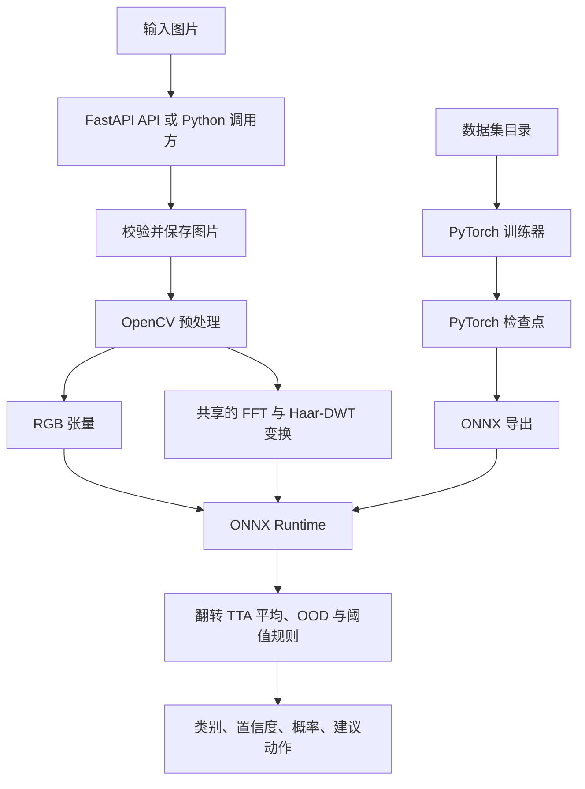
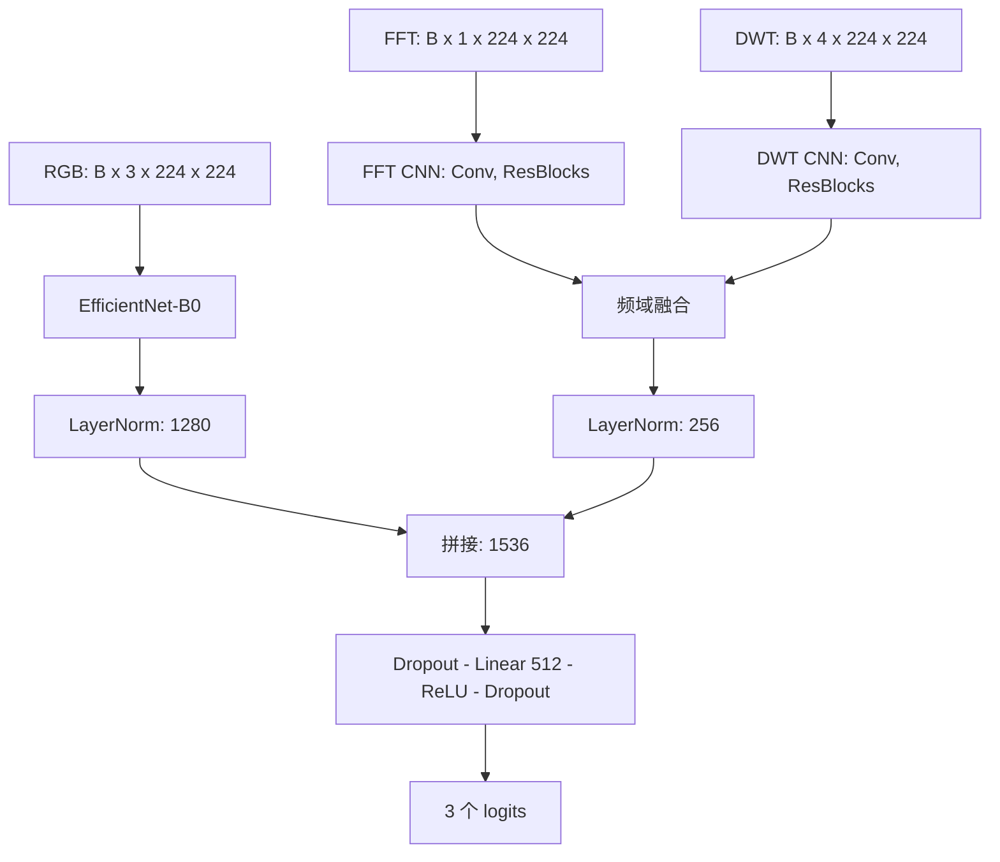
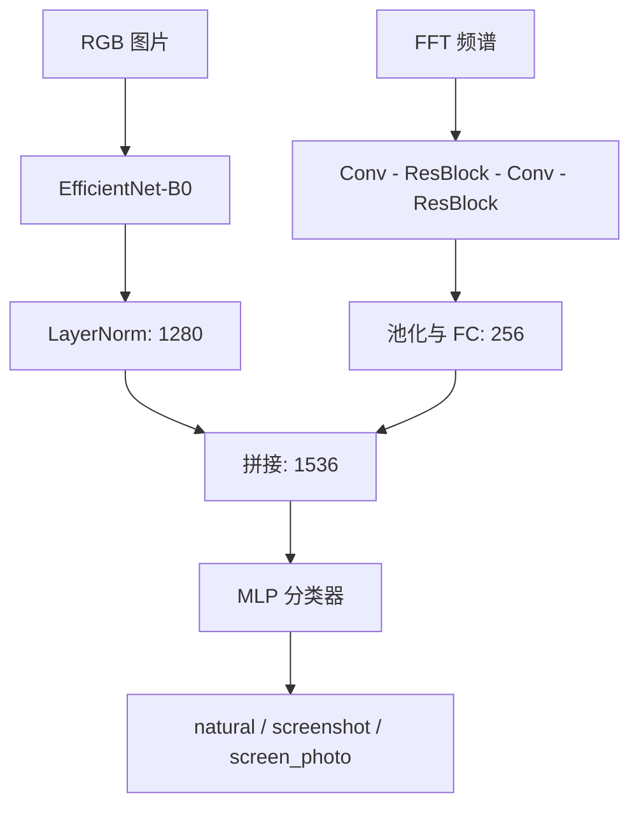
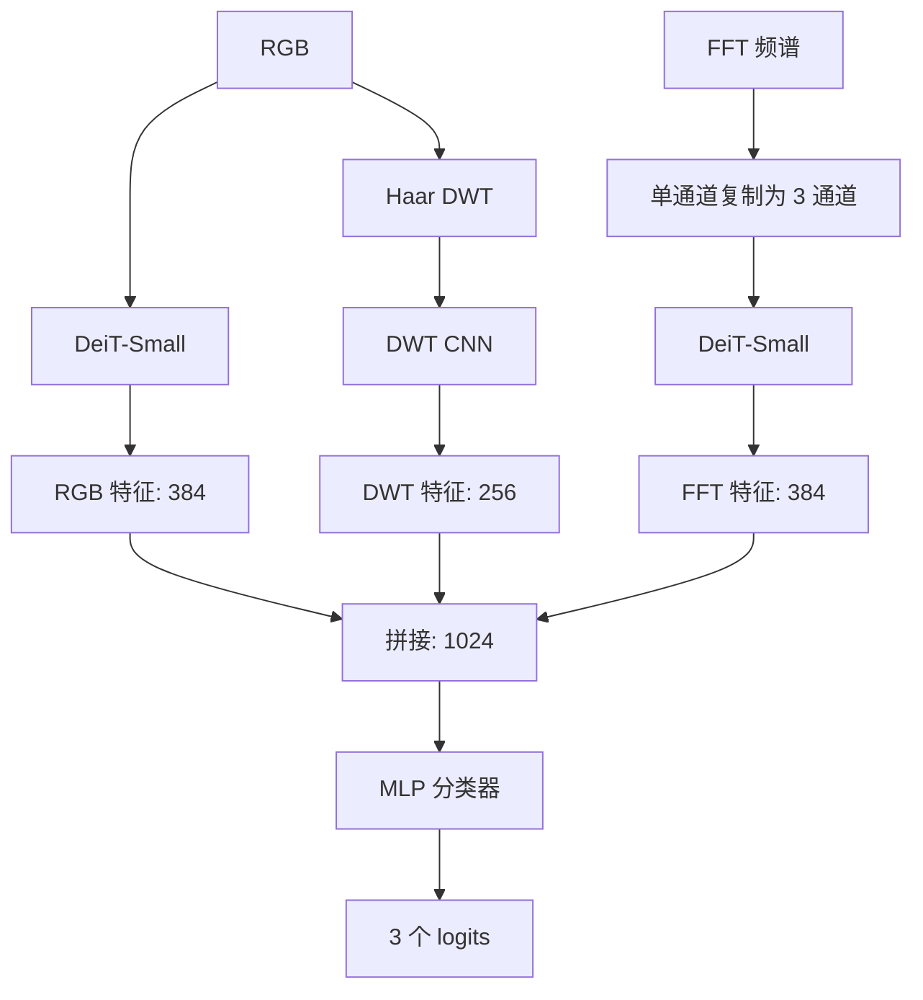
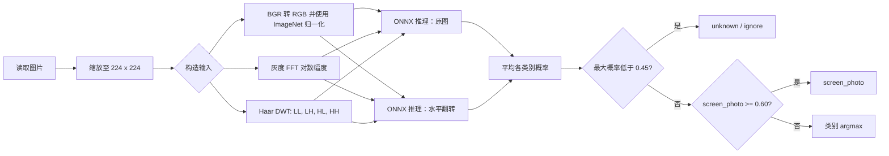
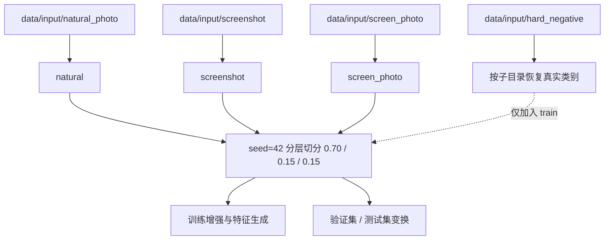
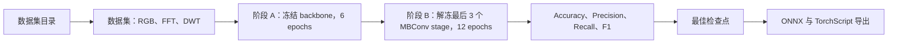
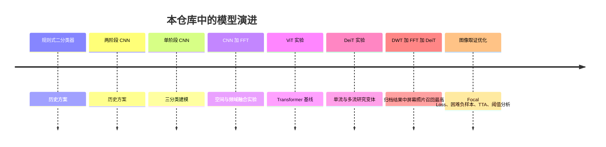

# OpenCV Screen Detector

[](pyproject.toml) [](https://pytorch.org/) [](https://fastapi.tiangolo.com/) [](https://onnxruntime.ai/)

[English](README.md) | **简体中文**

## 项目介绍

OpenCV Screen Detector 用于识别图像来源，将每张图片分类为 **natural**（自然照片）、**screenshot**（截图）或 **screen_photo**（相机拍摄的屏幕）。项目结合空间外观、FFT 与 Haar-DWT 频域特征，并提供基于 ONNX Runtime 的 FastAPI 服务。

仓库包含可部署的 EfficientNet-B0 + FFT + DWT 模型、对应的 PyTorch 训练流程，以及可复现实验用的 CNN/DeiT 研究代码。这是图像分类器而非目标检测器：每张输入图片只输出一个类别。

## 项目亮点

- 三来源分类；ONNX 模型同时接收 RGB、FFT 与 DWT 输入。
- 训练和服务端共用 OpenCV 预处理，保证 FFT/DWT 变换一致。
- 推理内置 TTA、低置信度/OOD 处理及屏幕照片阈值规则。
- FastAPI 支持文件上传、URL 检测、分类更新、健康检查与 ZIP 导出。
- 研究流程可对比 CNN、FFT、DeiT 与 DWT+FFT+DeiT 模型。
- **`experiment/cnn_fft_dwt_ablation/` 消融实验 harness**：15+ 配置自动批量训练、排行榜管理、ONNX 一键导出与端到端验证。

## 目录

<details>
<summary>展开目录</summary>

- [功能特性](#功能特性)
- [项目架构](#项目架构)
- [模型架构](#模型架构)
- [图像分类流程](#图像分类流程)
- [数据集](#数据集)
- [安装](#安装)
- [快速开始](#快速开始)
- [训练](#训练)
- [推理](#推理)
- [REST API](#rest-api)
- [项目结构](#项目结构)
- [实验结果](#实验结果)
- [性能对比](#性能对比)
- [模型演进](#模型演进)
- [部署](#部署)
- [配置](#配置)
- [未来工作](#未来工作)
- [许可证](#许可证)
- [致谢](#致谢)
</details>

## 功能特性

| 范畴 | 已实现能力 |
| --- | --- |
| 类别 | `natural`、`screenshot`、`screen_photo`；低置信度时输出 `unknown` |
| 训练 | 两阶段微调、CUDA 可用时的 AMP、Focal Loss(γ=2)+label smoothing、EMA(decay 0.999)、加权采样、困难负样本 |
| 特征 | ImageNet 归一化 RGB、对数幅度 FFT、Haar DWT 子带 |
| 推理 | ONNX Runtime、水平翻转 TTA、LRU 特征缓存、置信度分级 |
| 服务 | FastAPI、图片上传/URL 拉取、SQLite 图片索引、流式 ZIP 打包 |
| 研究 | `experiment/cnn_fft_dwt_ablation/` 消融 harness（15 配置矩阵、自动排行榜）；CNN/FFT/DeiT 消融 |
| 部署验证 | `experiment/cnn_fft_dwt_ablation/deploy_eval.py` 端到端 ONNX 性能评估脚本 |

## 项目架构



## 模型架构

### 已部署的 CNN + FFT + DWT 模型

默认导出模型为 `ScreenDetectorModelWithDWT`。EfficientNet-B0 生成 1,280 维空间特征；双流频域分支分别处理单通道 FFT 频谱和四个 Haar-DWT 子带，再生成 256 维特征。两个经 LayerNorm 的特征拼接为 1,536 维，并分类为三个 logits。



### CNN + FFT 研究变体

该双输入变体仍可通过 `create_model(use_dwt=False)` 使用，并被研究代码采用。



### DWT + FFT + DeiT 研究变体

实验性三流模型使用 RGB DeiT-Small 特征、处理复制为三通道 FFT 频谱的第二个 DeiT-Small 流，以及一个 DWT CNN。默认 API 不加载此模型。



## 图像分类流程



## 数据集

请将图片置于 `data/input`。数据集仅在本地使用，不随此仓库分发。



| 目录 | 训练标签 | 内容说明 |
| --- | --- | --- |
| `natural_photo/` | `natural` | 人像、场景、物体、室内等相机照片 |
| `screenshot/` | `screenshot` | 截图、UI、IDE、幻灯片、终端与聊天窗口 |
| `hard_negative/` | 按子目录推导 | 已确认边界案例保留真实类别；仅参与 train，不进入 val/test |
| `screen_photo/` | `screen_photo` | 相机拍摄的显示设备照片 |

**当前部署模型训练数据**（2026-07-22 更新）：
- 总样本：**2,928 张**（去重后；含 hard_negative）
- 切分：seed=42 严格 stratified，**train 2,194 / val 366 / test 368**（**无样本级泄漏**）
- 数据集指纹：`6367b7638c3871a81e05e4ca41f2bf87ed12d711ff1ac0ad9c96a3495a6acc2a`
- 旧基线训练时 hard_negative 在 train 与 val 中以 3× 权重重复出现，新训练已修复此问题
- `trainer/hard_examples.txt` 中的已确认本地回归固定进入 train，使用显式 sampler 权重，并作为发布 checkpoint 门槛。

数据集会变化；每个新模型都应同时报告其确切数据划分。

## 安装

要求：Python `>=3.11,<3.13` 与 [uv](https://docs.astral.sh/uv/)。训练建议使用支持 CUDA 的 GPU；服务端可在 CPU 上运行 ONNX Runtime。

```bash
# 在本仓库根目录执行。
uv sync
```

以上命令可在 Windows PowerShell、Linux 与 macOS 的 POSIX shell 中使用。仅在需要训练时安装训练依赖：

```bash
uv sync --group train
```

## 快速开始

### 启动 API

```bash
uv run python main.py
```

访问 `http://127.0.0.1:8325/docs` 可打开自动生成的 OpenAPI 界面。

### Python 推理

```python
from pathlib import Path
from inference.predictor import ScreenDetectorPredictor

result = ScreenDetectorPredictor().predict(Path("path/to/image.jpg"))
print(result["class"], result["confidence"])
```

### 训练并导出 ONNX

```bash
uv sync --group train
uv run python -m trainer train
uv run python -m trainer export
```

导出器会写入 `inference/models/three_class.onnx`，该路径正是服务端使用的路径。

## 训练

### 两阶段训练策略

发布训练器以预训练 EfficientNet-B0 初始化，先训练分类头和频域分支 6 个 epoch，再解冻 backbone 最后 3 个 MBConv stage，微调 12 个 epoch。检查点先要求 `trainer/hard_examples.txt` 中所有可用图片分类正确，再按下式选优：

`0.5 * screen_photo_f1 + 0.3 * accuracy + 0.2 * macro_f1`



```bash
# 可复现发布训练（干净切分、版本化缓存、hard-example 门槛）
uv run python -m trainer train
uv run python -m trainer export

# 仅保留用于复现历史基线的旧训练器
uv run python -m trainer train_legacy

uv run python -m trainer ablation --modules baseline,arcface,attention --epochs-head 5 --epochs-finetune 10
```

训练输出位于 `trainer/checkpoints/` 与 `trainer/logs/`。

### 当前发布配置

2026-07-22 当前发布沿用消融验证出的损失函数、EMA、backbone、增广与 FFT+DWT 选择，但采用新的受控候选参数；它在当前切分上优于 README 上一次记录的可发布模型：

| 项 | 值 | 说明 |
| --- | --- | --- |
| Focal Loss γ | 2.0 | γ=3.0 会退步 sp_f1 ~3pp |
| Class α | [1.0, 1.0, 1.5] | α=2.0 微退；α=2.5 严重退化 |
| Label smoothing | 0.05 | 0 或 0.10 都更差 |
| EMA | decay=0.999 | 关闭后 sp_f1 退步 2.4pp |
| 解冻 stage 数 | 3 | 当前发布候选；早期 15 配置筛选中 1 stage 更优 |
| hard-example 采样权重 | 2.0 | 2026-07-22 在 1×/2×/4× 候选中选中 |
| 训练轮数 | 6 + 12 | 当前发布更短；最佳 checkpoint 为 finetune 第 11 轮 |
| Backbone | efficientnet_b0 | B1 在 6GB 显存下无明显收益 |
| 增强 | 温和（关 MoireSimulation 等强增广） | 强增广退步 ~5pp acc |
| FFT + DWT | 都启用 | 移除 DWT 后 sp_f1 退步 5pp |

### `experiment/cnn_fft_dwt_ablation/` 消融实验工作流

```bash
# 1) 启动 15 配置矩阵（顺序训练约 4 小时，自动写排行榜）
PYTHONUNBUFFERED=1 nohup uv run python -u experiment/cnn_fft_dwt_ablation/harness.py screen > experiment/cnn_fft_dwt_ablation/logs/screen.log 2>&1 &

# 2) 查看排行榜（按 test_metric 排序）
uv run python experiment/cnn_fft_dwt_ablation/show.py

# 3) 取最优配置做全量多种子训练
uv run python experiment/cnn_fft_dwt_ablation/finalist.py --seeds 42 2024 7

# 4) 导出 ONNX 并验证 PyTorch↔ONNX 数值一致
uv run python experiment/cnn_fft_dwt_ablation/finalize_export.py trainer/checkpoints/three_class_best.pth inference/models/three_class.onnx

# 5) 端到端部署验证（对当前全部 368 张 test 集跑推理）
uv run python experiment/cnn_fft_dwt_ablation/deploy_eval.py
```

`experiment/cnn_fft_dwt_ablation/` 目录包含：
- `harness.py` — 训练循环、模型、FFT/DWT 缓存、RAM 预加载、ExpConfig 数据类
- `finalist.py` — 多种子训练 + 自动选优
- `finalize_export.py` — ONNX 导出 + 数值一致性验证
- `deploy_eval.py` — 部署后的端到端性能评估
- `show.py` — 排行榜查看
- `leaderboard.jsonl` — 全部实验记录（JSONL 追加格式）
- `REPORT.md` — 完整中文消融报告

`trainer/release_train.py` 是当前发布配置的正式封装：验证数据集指纹、记录逐 epoch 历史、训练时备份旧 checkpoint，并且只在完整训练成功后发布 `three_class_best.pth`。`trainer/train.py` 通过 `train_legacy` 保留，不代表发布默认值。

可选的 PAH-ViT 流程属于实验功能：

```bash
uv run python -m trainer train_pahvit
uv run python -m trainer benchmark
uv run python -m trainer validate_pahvit
```

## 推理

当前 ONNX 图有三个命名输入：`rgb_input`（`B×3×224×224`）、`fft_input`（`B×1×224×224`）与 `dwt_input`（`B×4×224×224`）。`ScreenDetectorPredictor` 会从图片路径构造它们。

```bash
uv run python -m inference.batch_detect path/to/images inference/output/results.json
```

预测器会平均原图与水平翻转图的预测。当最大概率低于 `0.45` 时返回 `unknown`；否则 `screen_photo` 概率达到 `0.60` 时优先判为屏幕照片，其余情况取 argmax。建议动作分别为 `accept`（≥0.92）、`review`（≥0.75）和 `ignore`（<0.75）。

## REST API

| 端点 | 用途 |
| --- | --- |
| `GET /api/health` | 服务与模型加载状态 |
| `POST /api/detect/upload` | 上传图片，返回是否为屏幕照片 |
| `POST /api/detect` | 下载图片 URL 并分类 |
| `POST /api/classify` | 更新已保存图片的分类 |
| `POST /api/package` | 按时间戳流式返回已索引图片的 ZIP |

```bash
curl http://127.0.0.1:8325/api/health

curl -X POST http://127.0.0.1:8325/api/detect/upload \
  -F "file=@path/to/image.jpg"

curl -X POST http://127.0.0.1:8325/api/detect \
  -H "Content-Type: application/json" \
  -d '{"url":"https://example.com/image.jpg"}'
```

检测响应示例：

```json
{"image_id":"<sha256>","is_screen":true}
```

`/api/package` 接收 ISO-8601 时间戳，例如 `{"after_timestamp":"2026-07-01T00:00:00Z"}`。压缩前限制为 10,000 个文件和 20 GiB；两个限制都会在流式响应开始前预检，超限请求会正常返回 JSON 413。

## 项目结构

```text
opencv-screen-detector/
├── main.py                    # Uvicorn 入口
├── pyproject.toml             # Python 依赖与工具配置
├── Dockerfile.inference       # 推理镜像定义
├── shared/                    # 共享 FFT/DWT 变换
├── inference/                 # ONNX Runtime 预测器与 FastAPI 服务
│   ├── api/                   # 应用、路由、数据模型、工具
│   ├── models/                # three_class.onnx
│   ├── predictor.py           # TTA 与后处理
│   └── batch_detect.py        # 递归批量推理
├── trainer/                   # CNN+FFT+DWT 训练与导出
│   ├── release_train.py       # 当前发布训练封装
│   ├── model.py               # EfficientNet/频域融合模型
│   ├── hard_examples.txt      # 已确认本地回归清单
│   ├── dataset.py             # 历史 RGB/FFT/DWT 数据集
│   ├── train.py               # 历史训练器（train_legacy）
│   └── ablation.py            # 优化消融实验
├── experiment/                # 多模型实验运行器
│   └── cnn_fft_dwt_ablation/  # 消融与发布训练 harness
│       ├── harness.py         # 训练循环 + ExpConfig + 版本化缓存
│       ├── finalist.py        # 历史多种子决赛训练
│       ├── finalize_export.py # 历史 ONNX 一致性工具
│       ├── deploy_eval.py     # 生产 ONNX 端到端评估
│       ├── show.py            # 排行榜查看
│       ├── leaderboard.jsonl  # 实验记录
│       └── REPORT.md          # 完整中文报告
├── tests/                     # 单元与集成测试
└── data/                      # 本地数据集和生成输出（已忽略）
```

## 实验结果

### 当前部署模型（2026-07-22，`candidate_20260722_unf3_focus2_6x12`）

当前 6+12 epoch 发布训练选中 `finetune-11`，两张已确认难例均通过，并导出 22.2 MB ONNX（`96aedc9f…`）。其 PyTorch argmax 结果为 accuracy 0.9429 / screen_photo F1 0.9076 / macro F1 0.9361 / metric 0.9239。

随后把相关可部署工件放到同一当前 368 张测试清单上，使用完全相同的 ONNX Runtime、TTA、OOD 和阈值策略对照：

| 生产 ONNX 候选 | Accuracy | screen_photo F1 | Macro F1 | Metric | 必须通过的 screenshot 门槛 | 发布资格 |
| --- | ---: | ---: | ---: | ---: | ---: | --- |
| 上一生产模型（`4b419976…`） | **0.9402** | **0.8870** | **0.9376** | **0.9131** | 0/2 | 无 |
| README 上一版发布（`cbba84bd…`） | 0.9158 | 0.8598 | 0.9145 | 0.8875 | 2/2 | 有 |
| 当前发布（`96aedc9f…`） | 0.9158 | **0.9043** | 0.9262 | 0.9121 | **2/2** | **有** |

当前发布相对 README 上一版可发布模型提升 +4.45 pp screen_photo F1、+1.16 pp macro F1、+2.46 pp metric，accuracy 持平。更早的 `4b419976…` 工件普通综合 metric 仍略高，但两张必修截图门槛为 0/2，不具备发布资格。生产指标把 `unknown` 视为错误分类，与真实 API 行为一致。

旧 README 只记录了 accuracy 0.8946 / screen_photo F1 0.7630 / macro F1 0.8668，它只保留为历史背景，不替代上方同路径工件对照。其训练切分与 `hard_negative` 处理不同；上一生产工件的训练来源也不同于当前固定切分，因此解读普通指标时仍需保留这一限制。

**已确认 screenshot 回归**（生产 ONNX + TTA）：

| 图片 | 训练前 | 训练后 | screenshot 概率 | screen_photo 概率 |
| --- | --- | --- | ---: | ---: |
| `4a6e…ae8f9.png` | `screen_photo` | **`screenshot`** | 0.5552 | 0.3260 |
| `5cdc3…12a62.png` | `natural` | **`screenshot`** | 0.4679 | 0.3175 |

**置信度分布**：49 accept（high ≥0.92）、139 review（medium 0.75–0.92）、168 low-confidence ignore、12 OOD ignore。最近一次 CPU TTA 单跑诊断为 mean 351 ms / p50 334 ms / p95 454 ms。串行延迟容易受预热和机器负载影响，因此没有用延迟决定这些同架构工件的胜负。

### 历史 3 种子决赛结果

为检验稳定性，获胜配置跑了 3 个种子（42 / 2024 / 7）：

| Seed | test_acc | test_sp_f1 | test_macro_f1 | metric |
| --- | ---: | ---: | ---: | ---: |
| **42（上一版 finalist）** | **0.9322** | **0.8548** | **0.9174** | **0.8952** |
| 2024 | 0.9133 | 0.8276 | 0.8963 | 0.8670 |
| 7 | 0.9079 | 0.7788 | 0.8817 | 0.8381 |
| **AVG** | **0.9178** | **0.8204** | **0.8985** | **0.8668** |

这些归档训练使用上一版 369 张切分，且没有两张 hard-example 发布门槛。其均值（acc 0.9178, sp_f1 0.8204, macro_f1 0.8985）只保留为历史背景；部署指标以上方 2026-07-22 结果为准。

### 消融实验矩阵（15 配置，screening 阶段 H=6+F=12）

完整实验记录在 `experiment/cnn_fft_dwt_ablation/leaderboard.jsonl`，摘要如下（按 test_metric 排序）：

| 排名 | id | test_acc | test_spF1 | macro_F1 | metric | 配置变更 |
| ---: | --- | ---: | ---: | ---: | ---: | --- |
| 🥇 | **a_unf1** | **0.9431** | 0.8943 | **0.9342** | **0.9169** | unfreeze=1（最佳） |
| 🥈 | a_unf3 | 0.9295 | **0.9000** | 0.9239 | 0.9136 | unfreeze=3 |
| 🥉 | a_b1 | 0.9295 | 0.8926 | 0.9219 | 0.9095 | B1 backbone + unfreeze=1 |
| 4 | ref | 0.9322 | 0.8814 | 0.9227 | 0.9049 | 干净默认（unfreeze=2） |
| 5 | a_alpha20 | 0.9295 | 0.8780 | 0.9201 | 0.9019 | α=2.0 |
| 6 | a_noema | 0.9187 | 0.8571 | 0.9070 | 0.8856 | 无 EMA |
| 7 | a_gamma3 | 0.9214 | 0.8522 | 0.9079 | 0.8841 | γ=3.0 |
| 8 | a_ls0 | 0.9295 | 0.8448 | 0.9128 | 0.8838 | 无 label smoothing |
| 9 | a_ls10 | 0.9214 | 0.8308 | 0.9050 | 0.8728 | label smoothing=0.10 |
| 10 | a_fftonly | 0.9187 | 0.8308 | 0.9024 | 0.8715 | 无 DWT |
| 11 | old_focal | 0.9051 | 0.8293 | 0.8906 | 0.8643 | 旧策略（γ3, heavy aug, 全解冻, 无 EMA） |
| 12 | a_cb99 | 0.9133 | 0.8214 | 0.8945 | 0.8636 | class-balanced 采样 β=0.99 |
| 13 | a_heavyaug | 0.8943 | 0.8254 | 0.8810 | 0.8572 | 强增广 |
| 14 | a_attn | 0.9106 | 0.7767 | 0.8827 | 0.8381 | +CBAM |
| 15 | a_alpha25 | 0.8943 | 0.7521 | 0.8664 | 0.8176 | α=2.5 |

**关键消融结论**：
- ✅ **核心胜出**：Focal(γ=2)+LS=0.05、EMA、解冻 1 stage、B0+FFT+DWT、温和增广
- ❌ **有害**：CBAM 注意力（sp_f1 -10pp）、class-balanced 采样、强增广（-5pp）、γ=3、α=2.5（-13pp）、全解冻
- 🏆 **旧策略 vs 新策略**：旧（γ3+heavy+all-unfreeze+no-EMA）→ 新（γ2+LS+EMA+unf1）sp_f1 提升 +5.2pp

### 研究模型对比

这五组归档结果来自实验运行器的单次试验；其 1,500 张训练集和验证集划分不同于上方已部署模型。表中使用 Macro F1，最后三列的 Precision/Recall/F1 专指 `screen_photo`。

| 模型 | Accuracy | Macro F1 | SP Precision | SP Recall | SP F1 | 推理时间 | 模型大小 |
| --- | ---: | ---: | ---: | ---: | ---: | --- | --- |
| EfficientNet-B0（CNN） | 94.39% | 92.57% | 86.49% | 88.89% | 87.67% | 未记录 | 未记录 |
| CNN + FFT | 93.58% | 89.46% | 81.82% | 75.00% | 78.26% | 未记录 | 未记录 |
| DeiT-Small | 93.85% | 91.61% | 82.05% | 88.89% | 85.33% | 未记录 | 未记录 |
| FFT + DeiT | 93.32% | 91.71% | 88.57% | 86.11% | 87.32% | 未记录 | 未记录 |
| DWT + FFT + DeiT | 93.85% | 91.95% | 82.50% | 91.67% | 86.84% | 未记录 | 未记录 |

仓库中存在 22.2 MB 的可部署 `three_class.onnx` 工件。由于训练流程和验证划分不同，不能将它与上表研究模型直接比较。

## 性能对比

当前生产路径在自身无泄漏留出集上达到 **acc 0.9158 / sp_f1 0.9043 / macro_f1 0.9262**。相对 README 历史值分别提升约 +2.1 pp、+14.1 pp、+5.9 pp；由于切分不同，这只能作为背景比较。

在同一当前 368 张清单和部署路径中，当前发布优于 README 上一版可发布模型（metric 0.9121 vs. 0.8875），同时保持 2/2 screenshot 门槛。更早的上一生产工件普通 metric 仍略高（0.9131），但强制 screenshot 门槛为 0/2，因此不是有效发布候选。

研究模型对比中 CNN 基线的总体 Accuracy 和屏幕照片 F1（87.67%）最高，而 DWT+FFT+DeiT 的已记录屏幕照片 Recall（91.67%）最高。每个研究模型仅有一次试验且 early stopping 较激进，这些观察只能作为方向性结论，不能视为生产基准。

部署比较应在目标硬件上使用相同的预热、图片集、batch size 和 ONNX Runtime provider，并同时记录 p50/p95 延迟、吞吐量、峰值内存、工件大小、各类别指标与强制回归门槛。`experiment/cnn_fft_dwt_ablation/deploy_eval.py` 支持 `--model`、`--output`、`--label`；当前模型最近一次 CPU 诊断（含 TTA）为 mean 351 ms / p50 334 ms / p95 454 ms。

## 模型演进



## 部署

可直接用 `uv run python main.py` 启动 API，或构建提供的容器：

```bash
docker build -f Dockerfile.inference -t opencv-screen-detector:local .
docker run --rm -p 8325:8325 \
  -v "${PWD}/inference/models:/app/inference/models:ro" \
  -v "${PWD}/data:/app/data" \
  opencv-screen-detector:local
```

Dockerfile 会复制 Git LFS 跟踪的 `inference/models/three_class.onnx`，但不会复制被忽略的训练数据；本地构建前需确保 LFS 对象已物化。镜像公开 8325 端口，并将上传文件与索引数据持久化在 `/app/data`；示例中的只读模型挂载可用于显式替换镜像内模型。

## 配置

运行时配置位于 `inference/config.py`；发布训练默认值位于 `trainer/release_train.py` 与 `experiment/cnn_fft_dwt_ablation/harness.py`。`trainer/config.py` 服务于旧训练器和 PAH-ViT 研究流程。

| 配置项 | 默认值 | 含义 |
| --- | ---: | --- |
| `image_size` | 224 | 空间输入的宽和高 |
| `ood_threshold` | 0.45 | 最大概率低于该值时返回 `unknown` |
| `confidence_high` | 0.92 | `accept` 阈值 |
| `confidence_medium` | 0.75 | `review` 阈值 |
| `screen_photo_threshold` | 0.60 | screen_photo 概率达此值强制判为屏幕照片 |
| `BATCH_SIZE` | 16 | 标准训练 batch size |
| `EPOCHS_HEAD` / `EPOCHS_FINETUNE` | 10 / 20 | 两个训练阶段 |
| `FOCAL_LOSS_GAMMA` | 2.0 | Focal Loss 聚焦参数（消融后由 3.0 调整为 2.0） |
| `LABEL_SMOOTHING` | 0.05 | 标签平滑（消融验证 0.05 > 0 / 0.10） |
| `EMA_DECAY` | 0.999 | 权重 EMA 衰减 |
| `UNFREEZE_STAGES` | 1 | Stage B 解冻的 MBConv stage 数 |
| `HARD_EXAMPLE_WEIGHT` | 4.0 | `trainer/hard_examples.txt` 中图片的 sampler 倍率 |

替换模型时必须保持预处理、模型输入和阈值一致。当前服务需要 [推理](#推理) 中所述的三输入 ONNX 图。

## 未来工作

- ~~为研究模型执行多随机种子重复实验和交叉验证。~~（已在 `experiment/cnn_fft_dwt_ablation/finalist.py` 完成 3 种子决赛）
- ~~建立固定切分与 hard-example 门槛的可复现发布工件。~~（已由 `trainer/release_train.py` 完成）
- 在独立 validation/calibration 集上校准决策阈值；测试集阈值扫描仅保留为诊断信息。
- 进一步扩充并审计屏幕照片边界案例，记录数据来源。
- 添加训练/导出兼容性及 API 冒烟测试的 CI 检查。
- 探索更细粒度的 FFT 重标定（per-bin mean/std）、Mixup/CutMix 与多任务联合训练。

## 许可证

本项目采用 [MIT 许可证](LICENSE)。

## 致谢

项目使用了 [PyTorch](https://pytorch.org/)、[timm](https://github.com/huggingface/pytorch-image-models)、[OpenCV](https://opencv.org/)、[FastAPI](https://fastapi.tiangolo.com/)、[ONNX Runtime](https://onnxruntime.ai/) 和 [uv](https://docs.astral.sh/uv/)。
