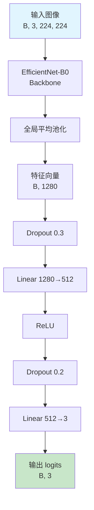
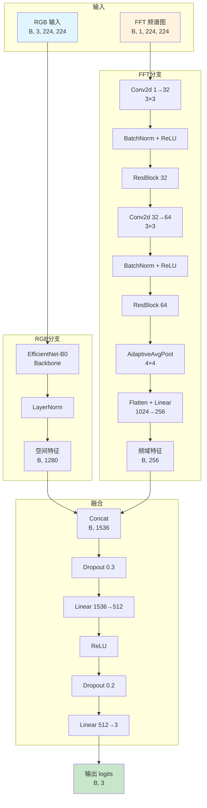
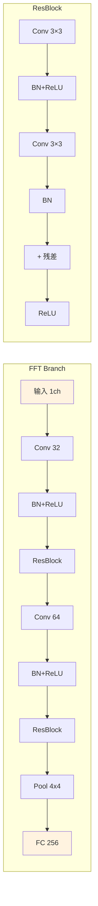
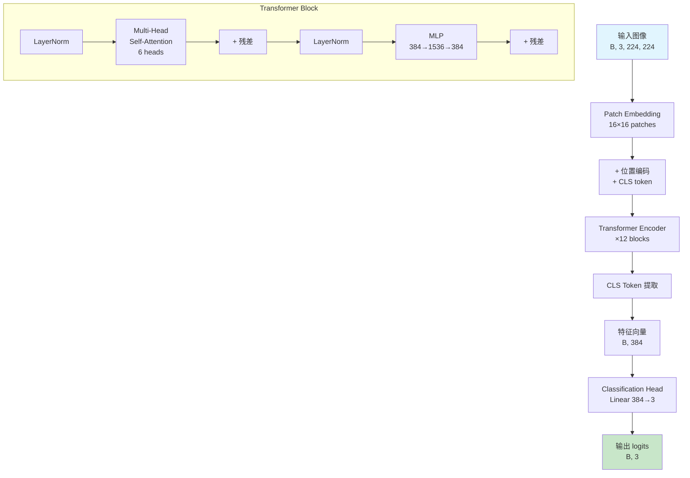
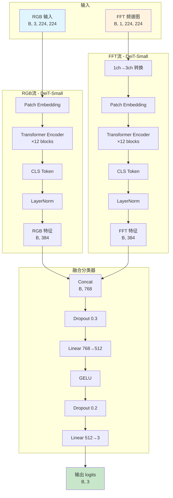
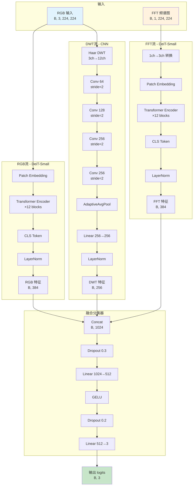
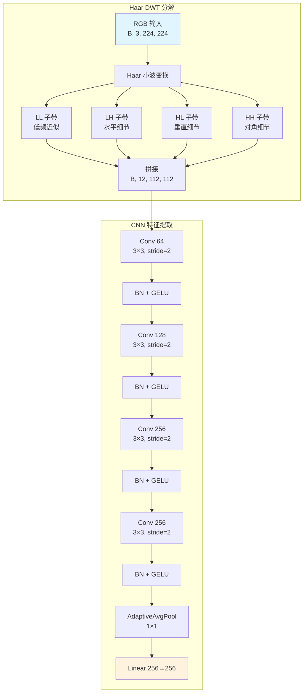
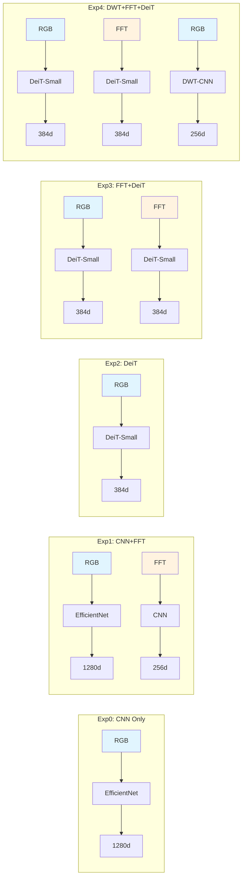

# 五种实验模型架构设计

本文档详细描述了屏幕检测器消融实验中的五种模型架构设计。

## 实验概览

| 实验 | 模型名称 | 描述 | 输入模式 |
|------|----------|------|----------|
| Exp0 | CNN Only | EfficientNet-B0 only | RGB |
| Exp1 | CNN+FFT | EfficientNet-B0 + FFT Branch | RGB + FFT |
| Exp2 | DeiT | DeiT-Small only | RGB |
| Exp3 | FFT+DeiT | Dual-stream DeiT | RGB + FFT |
| Exp4 | DWT+FFT+DeiT | Triple-stream DeiT | RGB + FFT + DWT |

---

## Exp0: CNN Only (EfficientNet-B0)

### 架构描述

最简单的基线模型，仅使用 EfficientNet-B0 处理 RGB 图像，不包含任何频域特征提取。

### 架构图



### 关键参数

- **Backbone**: EfficientNet-B0 (ImageNet 预训练)
- **特征维度**: 1280
- **输出类别**: 3 (natural, screenshot, screen_photo)

---

## Exp1: CNN+FFT (EfficientNet-B0 + FFT Branch)

### 架构描述

双分支 CNN 架构，RGB 分支使用 EfficientNet-B0 提取空间特征，FFT 分支使用轻量 CNN 提取频域特征。

### 架构图



### FFT Branch 详细结构



### 关键参数

- **RGB Backbone**: EfficientNet-B0 (1280 维)
- **FFT Branch**: Conv→ResBlock→Conv→ResBlock→Pool→FC (256 维)
- **融合维度**: 1280 + 256 = 1536
- **输出类别**: 3

---

## Exp2: DeiT-Small

### 架构描述

纯 Vision Transformer 架构，使用 DeiT-Small (Data-efficient Image Transformer) 作为 backbone。

### 架构图



### 关键参数

- **Backbone**: DeiT-Small (deit_small_patch16_224)
- **Patch Size**: 16×16
- **Hidden Dim**: 384
- **Transformer Blocks**: 12
- **Attention Heads**: 6
- **参数量**: ~22M
- **输出类别**: 3

---

## Exp3: FFT+DeiT (Dual-stream)

### 架构描述

双流 Transformer 架构，RGB 和 FFT 各自通过独立的 DeiT-Small 提取特征，然后进行特征融合。

### 架构图



### 关键参数

- **RGB Stream**: DeiT-Small (384 维)
- **FFT Stream**: DeiT-Small (384 维)，FFT 1ch→3ch 重复
- **融合维度**: 384 + 384 = 768
- **分类器**: 768→512→3 (GELU 激活)
- **输出类别**: 3

---

## Exp4: DWT+FFT+DeiT (Triple-stream)

### 架构描述

三流融合架构，结合 RGB (DeiT)、FFT (DeiT) 和 DWT (CNN) 三个分支，充分利用空间、频域和小波域特征。

### 架构图



### DWT Branch 详细结构



### DWT 子带说明

| 子带 | 名称 | 包含信息 | 对屏幕照片检测的作用 |
|------|------|----------|---------------------|
| LL | Low-Low | 低频近似 | 图像整体结构、边缘 |
| LH | Low-High | 水平细节 | 摩尔纹、水平条纹 |
| HL | High-Low | 垂直细节 | 屏幕边框、垂直线条 |
| HH | High-High | 对角细节 | 屏幕纹理、像素网格 |

### 关键参数

- **RGB Stream**: DeiT-Small (384 维)
- **FFT Stream**: DeiT-Small (384 维)
- **DWT Stream**: CNN (256 维)，Haar 小波 + 4 层 Conv
- **融合维度**: 384 + 384 + 256 = 1024
- **分类器**: 1024→512→3 (GELU 激活)
- **输出类别**: 3

---

## 模型对比总结



## 技术要点

### 1. 特征归一化

所有模型在融合前都使用 LayerNorm 对各分支特征进行归一化：

```python
self.rgb_norm = nn.LayerNorm(feat_dim)
self.fft_norm = nn.LayerNorm(feat_dim)
self.dwt_norm = nn.LayerNorm(dwt_out_features)
```

### 2. FFT 输入处理

FFT 频谱图为单通道，送入 DeiT 前需转换为 3 通道：

```python
fft_3ch = fft_input.repeat(1, 3, 1, 1)  # (B, 1, H, W) -> (B, 3, H, W)
```

### 3. DWT 变换

使用 Haar 小波进行 2D 离散小波变换：

```python
# Haar 滤波器系数
lo = [1.0, 1.0] / 2.0  # 低通
hi = [1.0, -1.0] / 2.0  # 高通

# 2D 滤波器: 外积
ll = lo ⊗ lo  # Low-Low
lh = lo ⊗ hi  # Low-High
hl = hi ⊗ lo  # High-Low
hh = hi ⊗ hi  # High-High
```

### 4. 融合策略

所有多分支模型采用相同的融合策略：

1. **特征提取**: 各分支独立提取特征
2. **特征归一化**: LayerNorm 归一化
3. **特征拼接**: Concat 沿特征维度
4. **分类器**: Dropout → Linear → 激活 → Dropout → Linear

---

## 预期效果

| 实验 | 优势 | 劣势 |
|------|------|------|
| Exp0 | 简单快速，易于部署 | 缺乏频域信息 |
| Exp1 | 引入频域特征，参数量适中 | CNN 感受野有限 |
| Exp2 | 全局注意力，长距离依赖 | 参数量较大 |
| Exp3 | 双流互补，RGB+FFT | 计算量翻倍 |
| Exp4 | 三流融合，最全面 | 计算量最大，训练复杂 |
